# A Bayesian implementation of the Correct Guess Rate Curve

### Reproduction of Szigeti et al. (2023) and an alternative uncertainty model

*2026-07-24*
# 1 Research question and executive summary

## 1.1 In plain terms (read this first)

You run a drug trial. Half the people get the real drug, half get a placebo, and nobody is told which. At the end you ask everyone to guess — and about 65% guess right. That is a problem: people who *believe* they got the real drug tend to feel better simply because they believe it, and since more of the drug group correctly believe they got the drug, this “belief bonus” piles up unevenly on the drug side. Some of the drug’s apparent benefit is really just that unevenness.

The **Correct Guess Rate Curve (CGRC)** asks a what-if: *what would this trial have shown if only 50% had guessed right* — the coin-flip you’d see if the blinding had actually worked? You can’t rerun the trial, but you can re-weight the people you already have so the maths reflects 50%-correct guessing, then re-take the difference between the two groups. That re-weighted difference is the CGRC estimate.

This document does two things: (1) it **reproduces** that method on a real microdosing dataset, and (2) it offers a **Bayesian** version that reports the answer as a *range with a probability attached* (“the effect is 1.1 points, and there’s a 79% chance it’s positive”) instead of a single number plus a p-value. It is **not** claimed to be a better answer — it targets the same quantity — just a more honest way of showing the uncertainty. Along the way it checks the original paper’s arithmetic, finds and fixes a few small errors on both sides, and flags what still needs the original author. Every number below is computed by the code shown, not asserted.

## 1.2 The technical version

Blinding is supposed to distribute expectancy effects equally between arms. If patients can work out their allocation and expect the active arm to help, that distribution becomes unequal and the trial tilts toward the active treatment. Szigeti et al. call this *activated expectancy bias* and propose the Correct Guess Rate Curve (CGRC): estimate what the trial would have shown had the correct guess rate been 50%.

This document has **two separate objectives**, kept apart throughout:

1.  **Reproduce** the published CGRC estimand and treatment-effect curves (Sections 2–4, 8, 10).
2.  **Develop an alternative implementation** that propagates uncertainty with a posterior rather than by resampling (Sections 5–7, 9, 11).

The Bayesian version is **not** presented as better inference about this trial. Section 8 shows the original procedure and this one target the same quantity. The defensible claims are narrower: it removes a Monte Carlo error term with no scientific content, and it replaces an average of p-values — which has no accepted interpretation — with a posterior distribution that has one.

**Headline numbers (PANAS, week 1).** Under the CGRC reweighting assumptions, the estimated contrast at CGR = 0.50 is 1.08 points (95% CrI −1.53 to 3.68), against an unadjusted 3.16 points at the observed CGR of 0.647. The posterior probability that the effect is positive falls from ~0.99 to ~0.79.

**What this does not establish.** Attenuation is not a measurement of “the amount caused by expectancy”, and matching the published curve does not validate the causal assumptions. See Section 12.

------------------------------------------------------------------------

# 2 The original CGRC procedure

Described accurately before any alternative is offered.

Szigeti’s method:

1.  Split scores into four strata by treatment × guess.
2.  Fit a **kernel density estimate** to each stratum (scikit-learn `KernelDensity`, all parameters at default — Gaussian kernel, bandwidth 1.0).
3.  Draw samples from the four KDEs in proportions such that the combined pseudo-dataset has the **target CGR**.
4.  Fit `outcome ~ treatment` to that pseudo-dataset.
5.  **Repeat, and average** the resulting estimates and p-values.

Steps 3–5 are the part this document replaces. Steps 1–2 define the estimand and are retained exactly.

**A note on the resample count.** The paper’s text (Fig 2 caption) says the KDE sampling is “repeated 100 times”. The author’s source repository ([`szb37/CorrectGuessRateCurve`](https://github.com/szb37/CorrectGuessRateCurve), `src/config.py`) tells a different story: its **Figure 4 configuration** (`cgrC_low`) specifies `n_cgrc_trials = 32` over `np.linspace(0, 1, 13)` — 32 resamples across 13 CGR grid points (the options are 32/64/96, never 100). Two caveats keep this from being airtight: the repo states it reproduces the *preprint* (a different title, then under peer review), so the config may be preprint-era rather than what generated the final published figure; and the Figure-4 block in `run.py` is disabled behind `if False:`. Still, none of the available options is 100, and if the real count is 32 then — because Monte Carlo error scales as \$1/\sqrt{n_{\text{rep}}}\$ — the error is about \$\sqrt{100/32} \approx 1.8\times\$ larger than a 100-resample assumption. Section 8 includes 32 in the ladder so the reader can see it either way.

Two properties of step 5 matter later. Averaging p-values across resamples has no accepted inferential interpretation — it is not a p-value for any hypothesis test. And resampling introduces Monte Carlo error into the reported estimate that is a property of the computation, not of the trial.

------------------------------------------------------------------------

# 3 The four-stratum estimand

## 3.1 Plain language

Every participant is in exactly one of four boxes: what they **got** crossed with what they **guessed**.

| Stratum | Got     | Guessed | Guess was |
|---------|---------|---------|-----------|
| `ACAC`  | active  | active  | correct   |
| `ACPL`  | active  | placebo | wrong     |
| `PLAC`  | placebo | active  | wrong     |
| `PLPL`  | placebo | placebo | correct   |

The **observed CGR** is the share who guessed right:

\$\$c\_{obs} = \frac{n\_{ACAC} + n\_{PLPL}}{n}\$\$

Practically: if \$c_{obs} = 0.65\$, 65% of participants knew what they were taking, so their expectancies were not balanced across arms.

To ask “what if only 50% had guessed right”, we reweight — put more weight on the wrong-guess boxes and less on the right-guess boxes. But we must not accidentally change the **arm balance** while doing it. Two ratios pin that down:

\$\$r = \frac{n\_{PLPL}}{n\_{PLPL} + n\_{ACAC}}, \qquad s = \frac{n\_{ACPL}}{n\_{ACPL} + n\_{PLAC}}\$\$

Practically: \$r\$ is “of the people who guessed right, what fraction were on placebo”; \$s\$ is “of the people who guessed wrong, what fraction were on active”. Holding these fixed means the reweighting only changes *how much guessing happened*, never *who got what*.

## 3.2 The four weights

| Weight        | Formula        | Meaning                |
|---------------|----------------|------------------------|
| \$w_{ACAC}\$ | \$c(1-r)\$     | active, correct guess  |
| \$w_{PLPL}\$ | \$cr\$         | placebo, correct guess |
| \$w_{ACPL}\$ | \$(1-c)s\$     | active, wrong guess    |
| \$w_{PLAC}\$ | \$(1-c)(1-s)\$ | placebo, wrong guess   |

**Algebraically**, the correct-guess weights sum to \$c\$:

\$\$w\_{ACAC} + w\_{PLPL} = c(1-r) + cr = c(1-r+r) = c\$\$

and the incorrect-guess weights sum to \$1-c\$:

\$\$w\_{ACPL} + w\_{PLAC} = (1-c)s + (1-c)(1-s) = (1-c)(s + 1 - s) = 1-c\$\$

so all four sum to 1. Section 4 checks this numerically.

## 3.3 The contrast

\$\$\Delta(c) = \underbrace{\frac{w\_{ACAC}\mu\_{ACAC} + w\_{ACPL}\mu\_{ACPL}}{w\_{ACAC} + w\_{ACPL}}}\_{\text{active arm}} - \underbrace{\frac{w\_{PLPL}\mu\_{PLPL} + w\_{PLAC}\mu\_{PLAC}}{w\_{PLPL} + w\_{PLAC}}}\_{\text{placebo arm}}\$\$

Each arm’s mean is a weighted average of its two strata; the denominators renormalise within arm. \$\Delta(0.5)\$ is the perfectly blinded estimate.

**The key identity.** At \$c = c_{obs}\$ the weights are proportional to the observed stratum shares, so each arm collapses to its ordinary sample mean:

\$\$\Delta(c\_{obs}) = \bar{y}\_{AC} - \bar{y}\_{PL}\$\$

This is the single most useful check available. It means the green reference line must intersect the curve exactly at the unadjusted difference — and it is how a misplaced reference line gets caught.

------------------------------------------------------------------------

# 4 Worked calculation by hand

Every number below is reproducible with a calculator.

```r
stopifnot(file.exists("pacutes.csv"))
raw <- read.csv("pacutes.csv", stringsAsFactors = FALSE)

if (requireNamespace("digest", quietly = TRUE)) {
  sha <- digest::digest("pacutes.csv", algo = "sha256", file = TRUE)
  stopifnot(identical(
    sha, "86aa784528ee045c61fadf3eacfd3e1897d16aae9839cee7cb4bfe839a7cc4e3"))
}

load_scale <- function(code, tp = "w1s1") {
  d <- raw[raw$test_name == code & raw$tp == tp, ]
  data.frame(condition = ifelse(d$condition == "MD", "AC", "PL"),
             guess     = ifelse(d$guess     == "MD", "AC", "PL"),
             value     = d$value, stringsAsFactors = FALSE)
}

SCALES <- c("PANAS" = "PANAS", "Mood VAS" = "mood",
            "Energy VAS" = "energy", "Cognitive performance" = "CPS")
sb <- lapply(SCALES, load_scale); names(sb) <- names(SCALES)
panas <- sb[["PANAS"]]
```

```r
st  <- cgr_strata(panas)
rat <- cgr_ratios(st)
obs <- cgr_observed(st)

data.frame(stratum = STRATA,
           n    = unname(lengths(st)[STRATA]),
           mean = round(unname(vapply(st[STRATA], mean, numeric(1))), 4),
           sd   = round(unname(vapply(st[STRATA], sd,   numeric(1))), 4),
           sum  = unname(vapply(st[STRATA], sum, numeric(1))))
```

| stratum |   n |    mean |      sd |  sum |
|:--------|----:|--------:|--------:|-----:|
| ACAC    |  48 | 19.5625 |  8.4272 |  939 |
| ACPL    |  43 | 12.3256 | 10.7276 |  530 |
| PLAC    |  39 | 18.3590 |  7.2855 |  716 |
| PLPL    | 102 | 10.9314 |  9.7962 | 1115 |

Expected: ACAC n=48 mean=19.5625; ACPL n=43 mean=12.3256; PLAC n=39 mean=18.3590; PLPL n=102 mean=10.9314.

\$\$c\_{obs} = \frac{48 + 102}{232} = \frac{150}{232} = 0.646552\$\$ \$\$r = \frac{102}{102+48} = 0.680000 \qquad s = \frac{43}{43+39} = 0.524390\$\$

```r
do.call(rbind, lapply(c(obs, 0.5), function(cc) {
  w <- cgr_weights(cc, rat$r, rat$s)
  data.frame(cgr = round(cc, 6),
             w_ACAC = round(w[["ACAC"]], 6), w_ACPL = round(w[["ACPL"]], 6),
             w_PLAC = round(w[["PLAC"]], 6), w_PLPL = round(w[["PLPL"]], 6),
             correct_sum = round(w[["ACAC"]] + w[["PLPL"]], 6),
             incorrect_sum = round(w[["ACPL"]] + w[["PLAC"]], 6))
}))
```

|      cgr |   w_ACAC |   w_ACPL |   w_PLAC |   w_PLPL | correct_sum | incorrect_sum |
|---------:|---------:|---------:|---------:|---------:|------------:|--------------:|
| 0.646552 | 0.206897 | 0.185345 | 0.168103 | 0.439655 |    0.646552 |      0.353448 |
| 0.500000 | 0.160000 | 0.262195 | 0.237805 | 0.340000 |    0.500000 |      0.500000 |

At \$c = c_{obs}\$: active arm \$= 6.331897/0.392241 = 16.142857\$, placebo arm \$= 7.892241/0.607759 = 12.985816\$, so \$\Delta = 3.157042\$.

At \$c = 0.50\$: active arm \$= 6.361707/0.422195 = 15.068169\$, placebo arm \$= 8.082520/0.577805 = 13.988321\$, so \$\Delta = 1.079847\$.

```r
mu <- lapply(st, mean)
data.frame(
  quantity = c("Delta(c_obs)", "raw AC - PL mean difference",
               "Delta(0.50)", "absolute identity error"),
  value = c(cgr_delta(obs, mu, rat$r, rat$s),
            mean(panas$value[panas$condition == "AC"]) -
              mean(panas$value[panas$condition == "PL"]),
            cgr_delta(0.5, mu, rat$r, rat$s),
            abs(cgr_delta(obs, mu, rat$r, rat$s) -
                  (mean(panas$value[panas$condition == "AC"]) -
                     mean(panas$value[panas$condition == "PL"]))))
)
```

| quantity                    |    value |
|:----------------------------|---------:|
| Delta(c_obs)                | 3.157042 |
| raw AC - PL mean difference | 3.157042 |
| Delta(0.50)                 | 1.079847 |
| absolute identity error     | 0.000000 |

The identity holds exactly.

------------------------------------------------------------------------

# 5 Bayesian probability model

Each stratum \$j \in \ACAC, ACPL, PLAC, PLPL\\$ gets its own mean and variance, with a Normal-Inverse-Gamma prior:

\$\$y\_{ij} \mid \mu_j, \sigma_j^2 \sim \mathcal{N}(\mu_j, \sigma_j^2)\$\$ \$\$\mu_j \mid \sigma_j^2 \sim \mathcal{N}\\\left(m_0, \frac{\sigma_j^2}{k_0}\right)\$\$ \$\$\sigma_j^2 \sim \text{Inverse-Gamma}(a_0, b_0)\$\$

The middle line is the one that matters and the one most easily got wrong: the prior on \$\mu_j\$ **depends on** \$\sigma_j^2\$. That is what makes the model conjugate. A model with \$\mu_j \sim \mathcal{N}(m_0, \text{const})\$ independently of \$\sigma_j^2\$ is a *different model* — see Section 8.

| Parameter | Mathematical role       | Practical meaning                                          | Behaviour as \$n\$ grows |
|-----------|-------------------------|------------------------------------------------------------|--------------------------|
| \$m_0\$   | prior mean of \$\mu_j\$ | where you’d guess the stratum mean sits before seeing data | influence \$\to 0\$      |
| \$k_0\$   | prior precision scale   | **prior sample size in pseudo-observations**               | swamped by \$n\$         |
| \$a_0\$   | IG shape                | prior confidence about the variance                        | swamped by \$n/2\$       |
| \$b_0\$   | IG scale                | prior scale of the variance                                | swamped by \$SS/2\$      |

Defaults are \$m_0 = 0\$, \$k_0 = 10^{-6}\$, \$a_0 = b_0 = 10^{-3}\$: deliberately vague, so the posterior mean lands on the sample mean and the reproduction check in Section 10 is like-for-like. \$k_0 = 10^{-6}\$ literally means the prior is worth one-millionth of an observation.

------------------------------------------------------------------------

# 6 Posterior derivation

Conjugacy gives closed-form updates:

\$\$k_n = k_0 + n\$\$ \$\$m_n = \frac{k_0 m_0 + n\bar{y}}{k_n}\$\$ \$\$a_n = a_0 + \frac{n}{2}\$\$ \$\$b_n = b_0 + \frac{1}{2}\sum_i (y_i - \bar{y})^2 + \frac{k_0 n (\bar{y} - m_0)^2}{2k_n}\$\$

Reading them:

- \$k_n\$: total information, prior pseudo-observations plus real ones.
- \$m_n\$: a **precision-weighted average** of prior mean and sample mean. With \$k_0\$ tiny, it is the sample mean.
- \$a_n\$: each observation contributes half a unit of shape.
- \$b_n\$: prior scale, plus observed scatter, plus a penalty for prior/data disagreement. That third term vanishes when \$k_0 \to 0\$.

```r
d <- nig_draws(st$ACAC, n_draws = 10, return_sigma2 = TRUE)
h <- d$hyper
data.frame(quantity = c("n", "ybar", "sum of squares", "k_n", "m_n",
                        "a_n", "b_n", "m_n - ybar", "E[sigma2]=b_n/(a_n-1)",
                        "sample variance"),
           value = c(h[["n"]], h[["ybar"]], h[["ss"]], h[["kn"]], h[["mn"]],
                     h[["an"]], h[["bn"]], h[["mn"]] - h[["ybar"]],
                     h[["bn"]] / (h[["an"]] - 1), var(st$ACAC)))
```

| quantity                |        value |
|:------------------------|-------------:|
| n                       |   48.0000000 |
| ybar                    |   19.5625000 |
| sum of squares          | 3337.8125000 |
| k_n                     |   48.0000010 |
| m_n                     |   19.5624996 |
| a_n                     |   24.0010000 |
| b_n                     | 1668.9074413 |
| m_n - ybar              |   -0.0000004 |
| E[sigma2]=b_n/(a_n-1) |   72.5580384 |
| sample variance         |   71.0172872 |

\$m_n\$ differs from \$\bar{y}\$ by about \$4 \times 10^{-7}\$. That is what “vague prior” means operationally.

## 6.1 Why draw \$\sigma^2\$ first

The joint posterior factorises as

\$\$p(\mu, \sigma^2 \mid y) = p(\sigma^2 \mid y)\\ p(\mu \mid \sigma^2, y)\$\$

The marginal \$p(\sigma^2 \mid y)\$ is Inverse-Gamma\$(a_n, b_n)\$ in closed form, and the conditional \$p(\mu \mid \sigma^2, y)\$ is \$\mathcal{N}(m_n, \sigma^2/k_n)\$. Drawing in that order — \$\sigma^2\$, then \$\mu\$ given it — produces exact draws from the joint.

**Two facts that are easy to conflate:**

- Iterations are **independent of each other**. Draw 500 tells you nothing about draw 501.
- Within a **single** iteration, \$\mu\$ and \$\sigma^2\$ are **dependent**: a draw with large \$\sigma^2\$ is paired with a more dispersed \$\mu\$.

That pairing is the mechanism by which variance uncertainty propagates into uncertainty about the mean. Inspect it directly:

```r
pd <- nig_draws(st$ACAC, n_draws = 4000, return_sigma2 = TRUE)
plot(sqrt(pd$sigma2), pd$mu, pch = 16, cex = 0.3,
     col = grDevices::adjustcolor("black", 0.25),
     xlab = expression(sigma~"(within-draw)"), ylab = expression(mu),
     main = "Paired posterior draws: larger sigma gives more dispersed mu")
abline(h = mean(st$ACAC), col = "red", lty = 2)
```

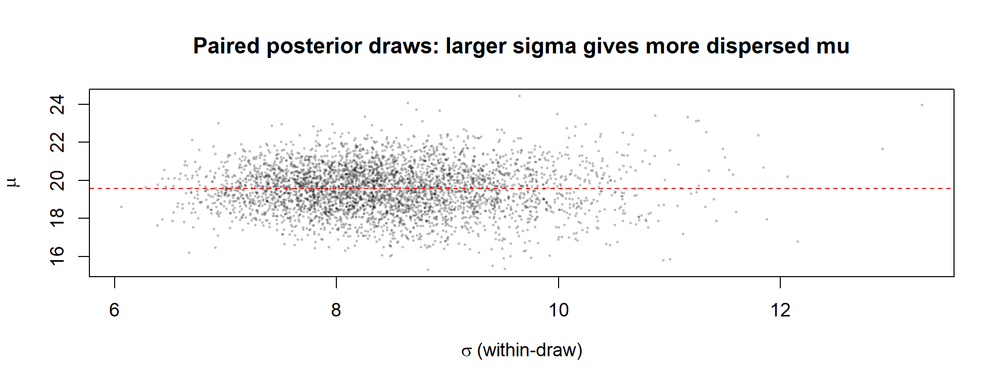

## 6.2 `n_draws` is not a sample size

Renamed from `S` to remove the ambiguity. `n_draws = 20000` reduces Monte Carlo error **in the posterior summaries** to roughly \$\text{sd}/\sqrt{20000}\$. It adds no information about participants. The data contain 232 people whatever `n_draws` is set to.

------------------------------------------------------------------------

# 7 R implementation

The implementation is the installed **`cgrc.bayes`** package (loaded in the setup chunk with `library(cgrc.bayes)`), so this document is a vignette rather than the only copy of the code. The package is built from these modules:

| File              | Contents                                                                            |
|-------------------|-------------------------------------------------------------------------------------|
| `R/01_estimand.R` | strata, ratios, weights, \$\Delta(c)\$, analytic curve, `cgr_reference_line_test()` |
| `R/02_bayes.R`    | `nig_draws()`, conjugate posterior curve                                            |
| `R/03_jags.R`     | corrected JAGS model, backend check                                                 |
| `R/04_kde.R`      | KDE procedure port; `cgr_kde_curve()` for the published figures                     |
| `R/05_sim.R`      | AEB generative model, operating characteristics                                     |
| `R/06_plot.R`     | Bayesian figures, `szigeti_panel()` published-style panels, summary tables          |
| `R/07_rope.R`     | `cgr_rope()` region-of-practical-equivalence decomposition                          |

Core functions, unfolded because they are short and load-bearing:

```r
cgr_weights <- function(c, r, s) {
  c(ACAC = c * (1 - r), ACPL = (1 - c) * s,
    PLAC = (1 - c) * (1 - s), PLPL = c * r)
}

cgr_delta <- function(c, mu, r, s) {
  w <- cgr_weights(c, r, s)
  (w[["ACAC"]] * mu$ACAC + w[["ACPL"]] * mu$ACPL) / (w[["ACAC"]] + w[["ACPL"]]) -
    (w[["PLPL"]] * mu$PLPL + w[["PLAC"]] * mu$PLAC) / (w[["PLPL"]] + w[["PLAC"]])
}
```

------------------------------------------------------------------------

# 8 Validation against the original method

Before any table, the published **figures** need reproducing in their own visual language, so a reader can lay this work beside the paper. Szigeti’s Figures 3 and 4 use a twin axis: **blue averaged p-value** on the left, **red treatment estimate** on the right, a magenta 0.05 threshold, a green “Original CGR” line, and a black “True blind CGR” line at 0.50. The p-values are the KDE-resampling averages (Section 6), *not* posterior quantities — this section deliberately reproduces the p-value presentation the rest of the document argues against, because that is what reproduction means.

## 8.1 Figure 3 reproduced: the AEB simulation

Four scenarios crossing direct treatment effect (DTE) and activated expectancy bias (AEB). “Original CGR” is the simulated guess probability \$p_{CG} = 0.7\$; “True blind CGR” is 0.50. The signature to check against the paper is panel 3 (`DTE off, AEB on`): a rising red estimate crossing zero near 0.50, so the blue p-value peaks near 0.50 and drops toward significance at both ends.

```r
CFG <- list(c(0, 0), c(1, 0), c(0, 1), c(1, 1))
labs <- c("DTE off; AEB off", "DTE on; AEB off",
          "DTE off; AEB on", "DTE on; AEB on")
set.seed(303)
par(mfrow = c(2, 2))
for (i in seq_along(CFG)) {
  d <- sim_aeb(230, 0.7, as.logical(CFG[[i]][1]), as.logical(CFG[[i]][2]), "all")
  szigeti_panel(cgr_kde_curve(d), labs[i], orig_cgr = 0.7, legend = (i == 1))
}
```

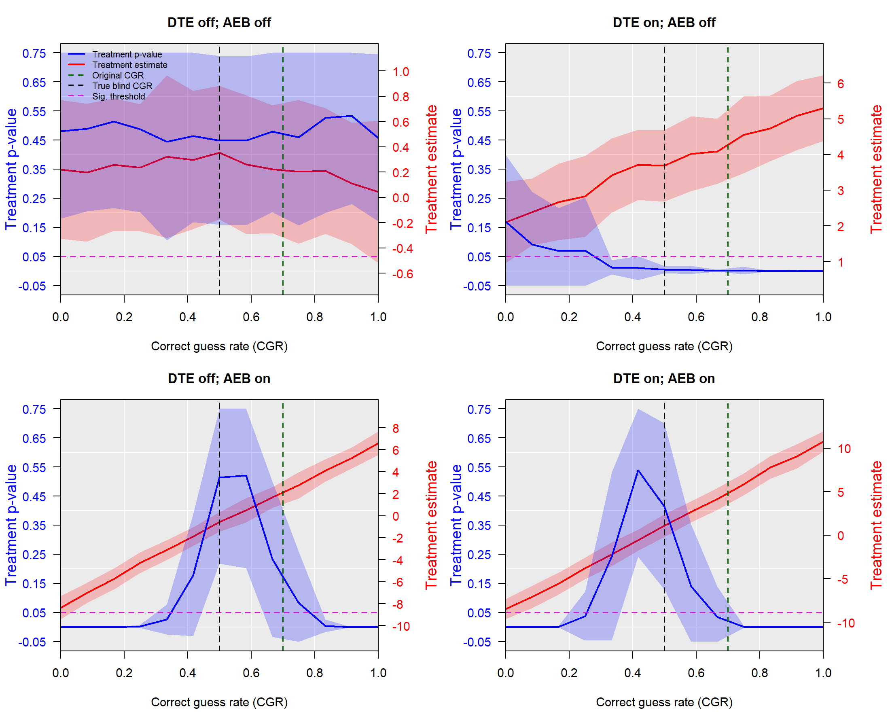

```r
par(mfrow = c(1, 1))
```

## 8.2 Figure 4 reproduced: the microdose trial

The empirical panels. The green line is drawn at **0.72** to match the original figure — but do not read it as the trial’s guess rate: it is a hardcoded constant (`trial_cgrs = {'sbmd': 0.72}`), and the reference-line test below shows the curve does **not** equal the paper’s reported unadjusted estimate at 0.72 (it does at the computed 0.647). Cognitive performance is the negative control: flat in both curves, because it is measured by objective tasks rather than self-report, so it should carry no expectancy signal.

```r
set.seed(404)
par(mfrow = c(2, 2))
for (i in seq_along(sb)) {
  szigeti_panel(cgr_kde_curve(sb[[i]]), names(sb)[i],
                orig_cgr = 0.72, legend = (i == 1))
}
```

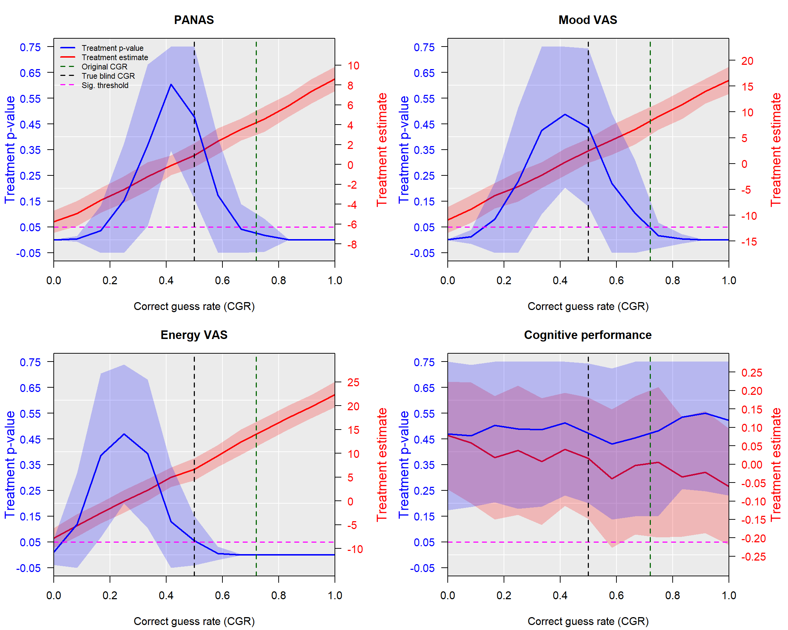

```r
par(mfrow = c(1, 1))
```

These should match the published Figures 3 and 4 panel for panel. The tables that follow quantify what the eye sees.

## 8.3 Stratum allocation, supplementary example

```r
ex <- data.frame(
  condition = c(rep("PL", 65), rep("AC", 35), rep("PL", 25), rep("AC", 75)),
  guess     = c(rep("PL", 65), rep("PL", 35), rep("AC", 25), rep("AC", 75)),
  value = 0)
rbind(
  data.frame(source = "supplementary target", ACAC = 54, ACPL = 58,
             PLAC = 42, PLPL = 46),
  data.frame(source = "this implementation",
             as.list(cgr_sizes(cgr_strata(ex), 0.5))),
  data.frame(source = "shipped-code 2dp rounding",
             as.list(cgr_sizes(cgr_strata(ex), 0.5, legacy_round = TRUE))))
```

| source                    | ACAC | ACPL | PLAC | PLPL |
|:--------------------------|-----:|-----:|-----:|-----:|
| supplementary target      |   54 |   58 |   42 |   46 |
| this implementation       |   54 |   58 |   42 |   46 |
| shipped-code 2dp rounding |   54 |   59 |   41 |   46 |

## 8.4 The observed-CGR identity across all outcomes

```r
do.call(rbind, lapply(names(sb), function(nm) {
  d <- sb[[nm]]; s <- cgr_strata(d); rr <- cgr_ratios(s)
  g <- cgr_delta(cgr_observed(s), lapply(s, mean), rr$r, rr$s)
  w <- mean(d$value[d$condition == "AC"]) - mean(d$value[d$condition == "PL"])
  data.frame(outcome = nm, n = nrow(d), delta_at_obs = g, raw_diff = w,
             abs_error = abs(g - w), pass = abs(g - w) < 1e-10)
}))
```

| outcome               |   n | delta_at_obs |   raw_diff | abs_error | pass |
|:----------------------|----:|-------------:|-----------:|----------:|:-----|
| PANAS                 | 232 |    3.1570415 |  3.1570415 |         0 | TRUE |
| Mood VAS              | 232 |    6.3370743 |  6.3370743 |         0 | TRUE |
| Energy VAS            | 232 |   11.3774452 | 11.3774452 |         0 | TRUE |
| Cognitive performance | 186 |   -0.0105232 | -0.0105232 |         0 | TRUE |

## 8.5 Faithful reproduction: Szigeti rounds the ratios

The identity above uses the **exact** within-class ratios \$r\$ and \$s\$. The author’s code does not: `get_strata_ratio` in [`szb37/CorrectGuessRateCurve`](https://github.com/szb37/CorrectGuessRateCurve) (`src/cgrc/core.py`) computes each stratum proportion as `round(x, 2)` before forming \$r\$ and \$s\$. So the **faithful reproduction path is `legacy_round = TRUE`**, and the exact-ratio default used elsewhere in this document — while mathematically the cleaner estimand, and the one for which the identity holds to machine precision — is *not* the number Szigeti actually computed. The impact is small but real:

```r
do.call(rbind, lapply(names(sb), function(nm) {
  s <- cgr_strata(sb[[nm]]); m <- lapply(s, mean); o <- cgr_observed(s)
  ex <- cgr_ratios(s, legacy_round = FALSE)   # exact
  lg <- cgr_ratios(s, legacy_round = TRUE)    # Szigeti's round(., 2)
  data.frame(outcome = nm,
             unadj_exact  = round(cgr_delta(o, m, ex$r, ex$s), 3),
             unadj_legacy = round(cgr_delta(o, m, lg$r, lg$s), 3),
             adj_exact    = round(cgr_delta(0.5, m, ex$r, ex$s), 3),
             adj_legacy   = round(cgr_delta(0.5, m, lg$r, lg$s), 3),
             shift = round(cgr_delta(o, m, lg$r, lg$s) -
                           cgr_delta(o, m, ex$r, ex$s), 3))
}))
```

| outcome               | unadj_exact | unadj_legacy | adj_exact | adj_legacy | shift |
|:----------------------|------------:|-------------:|----------:|-----------:|------:|
| PANAS                 |       3.157 |        3.167 |     1.080 |      1.090 | 0.010 |
| Mood VAS              |       6.337 |        6.354 |     2.517 |      2.536 | 0.017 |
| Energy VAS            |      11.377 |       11.397 |     7.104 |      7.125 | 0.019 |
| Cognitive performance |      -0.011 |       -0.011 |     0.006 |      0.005 | 0.000 |

Rounding shifts the unadjusted PANAS estimate by about +0.01 and Energy VAS by about +0.02 — negligible for any conclusion, but it is what Szigeti ran, so it is the correct baseline when the goal is to match the published table exactly rather than to state the exact estimand. The Bayesian sections keep the exact ratios, because there the object of interest is the estimand itself, not a byte-for-byte reproduction of the original script.

## 8.6 The reference-line test

The identity above makes the position of the reference line *checkable* rather than decorative: since \$\Delta(c_{obs})\$ equals the paper’s own reported unadjusted estimate, a line drawn at some claimed CGR is only in the right place if \$\Delta\$ there equals that value. The paper’s Figure 4 draws its “original CGR” line at **0.72** (Fig 4 caption; see `reports/SOURCES.md`), so this tests 0.72 against the computed observed CGR.

```r
pub_unadj <- c(PANAS = 3.2, `Mood VAS` = 6.4, `Energy VAS` = 11.5,
               `Cognitive performance` = 0.0)
do.call(rbind, lapply(names(sb), function(nm) {
  z <- cgr_reference_line_test(sb[[nm]], orig_cgr = 0.72,
                               published_unadj = pub_unadj[[nm]])
  data.frame(outcome = nm,
             published_unadj = z$published_unadj,
             computed_obs_cgr = round(z$computed_obs_cgr, 4),
             D_at_obs = round(z$D_at_obs, 2),
             err_at_obs = round(z$err_at_obs, 2),
             D_at_0.72 = round(z$D_at_orig_cgr, 2),
             err_at_0.72 = round(z$err_at_orig, 2))
}))
```

| outcome               | published_unadj | computed_obs_cgr | D_at_obs | err_at_obs | D_at_0.72 | err_at_0.72 |
|:----------------------|----------------:|-----------------:|---------:|-----------:|----------:|------------:|
| PANAS                 |             3.2 |           0.6466 |     3.16 |      -0.04 |      4.23 |        1.03 |
| Mood VAS              |             6.4 |           0.6466 |     6.34 |      -0.06 |      8.29 |        1.89 |
| Energy VAS            |            11.5 |           0.6466 |    11.38 |      -0.12 |     13.57 |        2.07 |
| Cognitive performance |             0.0 |           0.6290 |    -0.01 |      -0.01 |     -0.02 |       -0.02 |

Read `err_at_obs` against `err_at_0.72`. At the computed CGR of 0.647 the curve lands on the paper’s own reported unadjusted values to within ~0.12; at 0.72 it overshoots them by 1.0–2.1 points on the three self-report scales. So the green line as drawn is **not** the point where the curve equals the reported unadjusted estimate — the signature of a misplaced reference line.

**The source code settles why.** In [`szb37/CorrectGuessRateCurve`](https://github.com/szb37/CorrectGuessRateCurve) the reference line is drawn from `trial_cgrs = {'sbmd': 0.72}` in `src/config.py` — a **hardcoded constant**, not a quantity computed from the data. The same code *does* compute the trial’s CGR from the data as `(n_plpl + n_acac) / n` (= 0.647), but that computed value is not what the plot’s green line uses. So 0.72 is a fixed annotation that does not match the data’s correct guess rate; it coincides almost exactly with the **placebo-arm** correct-guess rate (0.7234, Section 10). This is no longer a hypothesis — see `reports/UNRESOLVED.md` U3 and `reports/SOURCES.md`.

## 8.7 Original KDE procedure vs the analytic curve

This is the section that separates the three possible sources of difference.

```r
set.seed(11)
# 32 is the resample count the author's code actually used for the CGR curve
# (config.py cgrC_low); 100 is the count the paper text describes.
kde_tab <- do.call(rbind, lapply(names(sb), function(nm) {
  d <- sb[[nm]]; o <- cgr_observed(cgr_strata(d))
  rbind(
    cbind(outcome = nm, target = "observed",
          cgr_kde_ladder(d, o,   reps = c(32, 100, 1000, 10000))),
    cbind(outcome = nm, target = "0.50",
          cgr_kde_ladder(d, 0.5, reps = c(32, 100, 1000, 10000))))
}))
kde_tab[, c("outcome","target","n_rep","kde_est","kde_mcse","mean_p",
            "analytic","diff_from_analytic")]
```

| outcome               | target   | n_rep |    kde_est |  kde_mcse |    mean_p |   analytic | diff_from_analytic |
|:----------------------|:---------|------:|-----------:|----------:|----------:|-----------:|-------------------:|
| PANAS                 | observed |    32 |  3.2119142 | 0.2226614 | 0.0794526 |  3.1570415 |          0.0548727 |
| PANAS                 | observed |   100 |  3.3130652 | 0.1194258 | 0.0623492 |  3.1570415 |          0.1560236 |
| PANAS                 | observed |  1000 |  3.0863317 | 0.0382973 | 0.0851312 |  3.1570415 |         -0.0707098 |
| PANAS                 | observed | 10000 |  3.1741531 | 0.0126348 | 0.0837844 |  3.1570415 |          0.0171116 |
| PANAS                 | 0.50     |    32 |  1.0091007 | 0.1662490 | 0.4776797 |  1.0798473 |         -0.0707466 |
| PANAS                 | 0.50     |   100 |  0.7523806 | 0.1211623 | 0.4615440 |  1.0798473 |         -0.3274667 |
| PANAS                 | 0.50     |  1000 |  1.1378863 | 0.0407211 | 0.3976220 |  1.0798473 |          0.0580390 |
| PANAS                 | 0.50     | 10000 |  1.0695928 | 0.0125296 | 0.4089534 |  1.0798473 |         -0.0102545 |
| Mood VAS              | observed |    32 |  6.6422254 | 0.4690454 | 0.0790750 |  6.3370743 |          0.3051511 |
| Mood VAS              | observed |   100 |  6.5396423 | 0.2888245 | 0.1002209 |  6.3370743 |          0.2025680 |
| Mood VAS              | observed |  1000 |  6.1749463 | 0.0825346 | 0.0996683 |  6.3370743 |         -0.1621279 |
| Mood VAS              | observed | 10000 |  6.3597085 | 0.0272827 | 0.0971288 |  6.3370743 |          0.0226342 |
| Mood VAS              | 0.50     |    32 |  2.9505499 | 0.5503081 | 0.4049219 |  2.5173085 |          0.4332414 |
| Mood VAS              | 0.50     |   100 |  2.9288682 | 0.2691688 | 0.3524469 |  2.5173085 |          0.4115597 |
| Mood VAS              | 0.50     |  1000 |  2.4930456 | 0.0816622 | 0.3906186 |  2.5173085 |         -0.0242629 |
| Mood VAS              | 0.50     | 10000 |  2.5260913 | 0.0269643 | 0.3822818 |  2.5173085 |          0.0087828 |
| Energy VAS            | observed |    32 | 11.8302495 | 0.4924442 | 0.0007420 | 11.3774452 |          0.4528043 |
| Energy VAS            | observed |   100 | 11.0262693 | 0.2445736 | 0.0013014 | 11.3774452 |         -0.3511760 |
| Energy VAS            | observed |  1000 | 11.4228692 | 0.0770195 | 0.0017612 | 11.3774452 |          0.0454240 |
| Energy VAS            | observed | 10000 | 11.3758277 | 0.0244001 | 0.0016266 | 11.3774452 |         -0.0016176 |
| Energy VAS            | 0.50     |    32 |  6.5489295 | 0.4012509 | 0.0593426 |  7.1039379 |         -0.5550084 |
| Energy VAS            | 0.50     |   100 |  7.0516019 | 0.2745983 | 0.0619977 |  7.1039379 |         -0.0523360 |
| Energy VAS            | 0.50     |  1000 |  7.1780871 | 0.0727985 | 0.0381852 |  7.1039379 |          0.0741492 |
| Energy VAS            | 0.50     | 10000 |  7.0448905 | 0.0237773 | 0.0438052 |  7.1039379 |         -0.0590474 |
| Cognitive performance | observed |    32 | -0.0640386 | 0.0304927 | 0.5211872 | -0.0105232 |         -0.0535154 |
| Cognitive performance | observed |   100 | -0.0047342 | 0.0167009 | 0.5176348 | -0.0105232 |          0.0057889 |
| Cognitive performance | observed |  1000 | -0.0119294 | 0.0054479 | 0.5033075 | -0.0105232 |         -0.0014062 |
| Cognitive performance | observed | 10000 | -0.0133915 | 0.0016941 | 0.5013208 | -0.0105232 |         -0.0028684 |
| Cognitive performance | 0.50     |    32 | -0.0055517 | 0.0288309 | 0.4569903 |  0.0056588 |         -0.0112105 |
| Cognitive performance | 0.50     |   100 |  0.0016203 | 0.0154388 | 0.5225344 |  0.0056588 |         -0.0040385 |
| Cognitive performance | 0.50     |  1000 |  0.0189986 | 0.0053872 | 0.4932684 |  0.0056588 |          0.0133398 |
| Cognitive performance | 0.50     | 10000 |  0.0066238 | 0.0016857 | 0.5019552 |  0.0056588 |          0.0009650 |

Three conclusions:

1.  **KDE versus a Gaussian stratum model contributes essentially nothing.** At 10 000 resamples the KDE average converges on the analytic value in every cell. The estimand uses only stratum means, and KDE smoothing preserves means.
2.  **Few resamples is materially noisy.** At 32 resamples — the count the repo’s Figure-4 config specifies (see the caveats in Section 2) — the Monte Carlo SE is roughly 0.2–0.5 points on the PANAS/VAS scales, about \$1.8\times\$ the 100-resample value and larger than the 0.12 discrepancy this document flags in the paper’s reference-line placement. PANAS at CGR 0.50 wanders by tens of a percent purely from resampling noise.
3.  **The averaged p-values reproduce the published ones** (PANAS ~0.41 vs 0.43; Energy ~0.043 vs 0.04), confirming the port is faithful rather than merely plausible.

So the difference between the original and this document is **computational stability plus a change of inferential summary** — not a change of estimand.

## 8.8 KDE averaged p-value vs the Bayesian posterior — head-to-head

The comparison above matched the KDE *point estimate* to the analytic value, and the two implementations agree there because both target \$\Delta(c)\$ and averaging mean-preserving resamples does not move a mean. What differs is the *inferential summary*: the original averages a two-sided \$t\$-test p-value across resamples, this one summarises a posterior. Those are not the same statement. This subsection puts them head to head — first on the real PANAS data, then as an operating-characteristic comparison over repeated simulated trials (the check noted as an open item in earlier drafts).

```r
set.seed(7)
kc <- cgr_kde_curve(panas, grid = seq(0, 1, length.out = 13), n_rep = 400)
cc <- cgr_conjugate(panas, grid = seq(0, 1, length.out = 13),
                    n_draws = 40000, direction = 1)
o  <- cgr_observed(cgr_strata(panas))
at <- function(g, cgr) g[which.min(abs(g$cgr - cgr)), ]
do.call(rbind, lapply(c(`observed CGR` = o, `perfect blinding` = 0.5), function(cg) {
  k <- at(kc, cg); b <- at(cc, cg)
  data.frame(
    `Delta(c): KDE / posterior` = sprintf("%.2f / %.2f", k$est, b$est),
    `KDE averaged p` = sprintf("%.3f", k$p),
    `posterior P(favourable)` = sprintf("%.3f", b$p_fav),
    `posterior 2-sided tail 2(1-P)` = sprintf("%.3f", 2 * (1 - b$p_fav)),
    check.names = FALSE)
}))
```

|                  | Delta(c): KDE / posterior | KDE averaged p | posterior P(favourable) | posterior 2-sided tail 2(1-P) |
|:-----------------|:--------------------------|:---------------|:------------------------|:------------------------------|
| observed CGR     | 3.51 / 3.44               | 0.049          | 0.996                   | 0.008                         |
| perfect blinding | 1.08 / 1.07               | 0.416          | 0.783                   | 0.433                         |

The two point estimates coincide at every CGR. The two evidence summaries need not: at the observed CGR the KDE averaged p-value is 0.049, while the posterior puts P(favourable) at 0.996 — a two-sided tail of about 0.008. Same estimand, same direction, but the averaged p-value is the more conservative summary.

To see whether that is systematic, the next chunk runs both procedures over the *same* simulated trials — 300 trials at \$n = 200\$, correct-guess rate 0.7 and a true 3-point effect — and compares their point estimates and their decisions at matched thresholds (two-sided \$p < 0.05\$ against posterior \$P > 0.975\$). It also re-runs the KDE step with the bandwidth set to zero, to test whether the kernel is responsible for any gap.

```r
set.seed(101)
N <- 300; n <- 200; p_cg <- 0.7; mu_dte <- 3
ke <- kp <- kp0 <- be <- bp <- rep(NA_real_, N)
for (i in seq_len(N)) {
  d <- sim_aeb(n, p_cg, dte_on = TRUE, aeb_on = FALSE, mu_dte = mu_dte)
  if (!all(STRATA %in% paste0(d$condition, d$guess))) next
  ke[i]  <- (k <- cgr_kde(d, 0.5, n_rep = 100))$est; kp[i] <- k$p
  kp0[i] <- cgr_kde(d, 0.5, n_rep = 100, bw = 0)$p          # bandwidth 0 control
  st <- cgr_strata(d); rat <- cgr_ratios(st)
  dd <- cgr_delta(0.5, lapply(st, nig_draws, n_draws = 4000), rat$r, rat$s)
  be[i] <- mean(dd); bp[i] <- mean(dd > 0)
}
ok <- !is.na(kp)

knitr::kable(data.frame(
  Quantity = c("Valid trials",
               "Point estimate — KDE mean (bias)",
               "Point estimate — posterior mean (bias)",
               "Point-estimate correlation (KDE vs posterior)",
               "Flag rate — KDE averaged p < 0.05",
               "Flag rate — KDE averaged p < 0.05, bandwidth 0",
               "Flag rate — posterior P(favourable) > 0.975",
               "Trials where the two decisions agree"),
  Value = c(sum(ok),
            sprintf("%.2f (%+.3f)", mean(ke[ok]), mean(ke[ok]) - mu_dte),
            sprintf("%.2f (%+.3f)", mean(be[ok]), mean(be[ok]) - mu_dte),
            sprintf("%.3f", cor(ke[ok], be[ok])),
            sprintf("%.3f", mean(kp[ok]  < 0.05)),
            sprintf("%.3f", mean(kp0[ok] < 0.05)),
            sprintf("%.3f", mean(bp[ok]  > 0.975)),
            sprintf("%.0f%%", 100 * mean((kp[ok] < 0.05) == (bp[ok] > 0.975)))),
  check.names = FALSE),
  caption = "KDE procedure vs Bayesian posterior over 300 simulated trials (true Delta = 3)")
```

| Quantity                                        | Value         |
|:------------------------------------------------|:--------------|
| Valid trials                                    | 300           |
| Point estimate — KDE mean (bias)                | 3.00 (-0.001) |
| Point estimate — posterior mean (bias)          | 2.99 (-0.007) |
| Point-estimate correlation (KDE vs posterior)   | 0.996         |
| Flag rate — KDE averaged p \< 0.05              | 0.540         |
| Flag rate — KDE averaged p \< 0.05, bandwidth 0 | 0.540         |
| Flag rate — posterior P(favourable) \> 0.975    | 0.740         |
| Trials where the two decisions agree            | 80%           |

KDE procedure vs Bayesian posterior over 300 simulated trials (true Delta = 3)

```r
ggplot(data.frame(kde = kp[ok], post2 = 2 * pmin(bp[ok], 1 - bp[ok])),
       aes(kde, post2)) +
  geom_abline(slope = 1, intercept = 0, colour = "grey60", linetype = "dashed") +
  geom_vline(xintercept = 0.05, colour = "#C0392B", linetype = "dotted") +
  geom_hline(yintercept = 0.05, colour = "#C0392B", linetype = "dotted") +
  geom_point(alpha = 0.5, colour = "#2471A3") +
  labs(x = "KDE averaged p-value (original procedure)",
       y = "posterior two-sided tail, 2 * min(P, 1 - P)",
       title = "Per-trial evidence: averaged p-value vs posterior") +
  theme_minimal(base_size = 13)
```

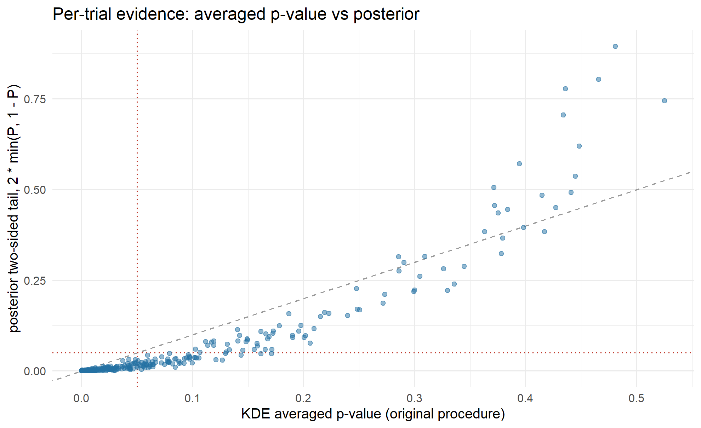

The two procedures **agree on the estimand** — the per-trial point estimates are almost perfectly correlated (\$r \approx\$ 0.996) and share the same small bias — but they **do not agree on the evidence**. At matched thresholds the posterior flags the effect in about 74% of trials against roughly 54% for the averaged p-value, and the two rules reach different conclusions on about 20% of trials; in the scatter the averaged p-value sits systematically above the identity line — a weaker evidence signal for the same trials. This is **not** a kernel artefact: setting the KDE bandwidth to zero leaves the flag rate essentially unchanged (0.540 vs 0.540). It is the *resample-and-average-a-p-value* step itself — which has no coherent inferential interpretation — that costs the original procedure detection power. Replacing it with a posterior probability is therefore not merely a change of vocabulary: it recovers evidence the averaging discards, while leaving the estimand untouched. That is the single clearest statement of what the Bayesian version adds.

## 8.9 Conjugate versus matched JAGS

The JAGS prior has been **corrected**. It previously used independent priors `mu[j] ~ dnorm(0, 1e-6)` and `tau[j] ~ dgamma(1e-3, 1e-3)`, which is *not* the Normal-Inverse-Gamma model, because NIG requires \$\text{Var}(\mu \mid \sigma^2) = \sigma^2/k_0\$, i.e. precision \$k_0 \tau\$. The corrected model is

    tau[j] ~ dgamma(a0, b0)
    mu[j]  ~ dnorm(m0, k0 * tau[j])

with the hyperparameters passed through the data list.

```r
chk <- cgr_check_backends(panas, GRID, n_draws = 40000,
                          jags_args = list(n_iter = 10000, n_chains = 4))
data.frame(quantity = names(chk), value = unlist(lapply(chk, as.character)))
```

|                   | quantity          | value                                                                 |
|:------------------|:------------------|:----------------------------------------------------------------------|
| max_abs_diff_mean | max_abs_diff_mean | 0.0180060968611269                                                    |
| max_abs_diff_lo   | max_abs_diff_lo   | 0.0525210565096037                                                    |
| max_abs_diff_hi   | max_abs_diff_hi   | 0.083040951353744                                                     |
| max_abs_diff_pfav | max_abs_diff_pfav | 0.00545                                                               |
| max_abs_z         | max_abs_z         | 1.3376182000001                                                       |
| max_rhat          | max_rhat          | 1.00013586676668                                                      |
| min_ess           | min_ess           | 39663.8273633717                                                      |
| verdict           | verdict           | PASS - differences within Monte Carlo error; identity claim supported |

------------------------------------------------------------------------

# 9 Simulation study

A single simulated trial is an illustration, not validation. This section runs **500 independent trials per scenario**.

True \$\Delta(0.5)\$ equals the direct treatment effect, because at perfect blinding the guess distribution is identical in both arms, so the AEB term contributes equally to each and cancels.

```r
op <- cgr_operating(n_trials = 500, n = 230, p_cg = 0.7,
                    noise = "all", n_draws = 4000, seed = 1)
op
```

| DTE | AEB | true | unadj_mean | unadj_bias |   adj_mean |   adj_bias |  adj_rmse | coverage95 | p_fav_gt_95 | unadj_p_fav_gt_95 | p_fav_gt_975 | freq_sig | empty_stratum_rate | n_valid |
|----:|----:|-----:|-----------:|-----------:|-----------:|-----------:|----------:|-----------:|------------:|------------------:|-------------:|---------:|-------------------:|--------:|
|   0 |   0 |    0 |  0.0147399 |  0.0147399 |  0.0249642 |  0.0249642 | 0.5884121 |      0.944 |       0.068 |             0.056 |        0.038 |    0.050 |                  0 |     500 |
|   1 |   0 |    3 |  3.0079329 |  0.0079329 |  3.0152420 |  0.0152420 | 1.0609251 |      0.964 |       0.874 |             0.942 |        0.798 |    0.870 |                  0 |     500 |
|   0 |   1 |    0 |  3.0110286 |  3.0110286 | -0.0306985 | -0.0306985 | 1.1098984 |      0.944 |       0.048 |             0.868 |        0.024 |    0.800 |                  0 |     500 |
|   1 |   1 |    3 |  6.0088050 |  3.0088050 |  3.0028967 |  0.0028967 | 1.4169530 |      0.936 |       0.694 |             0.998 |        0.548 |    0.996 |                  0 |     500 |

Reference values obtained while preparing this document:

| DTE | AEB | true | adj bias | RMSE | coverage | P(post\>0.95) | freq p\<.05 |
|-----|-----|------|----------|------|----------|---------------|-------------|
| off | off | 0    | 0.05     | 0.59 | 0.938    | 0.066         | 0.056       |
| on  | off | 3    | 0.05     | 1.09 | 0.936    | 0.892         | 0.876       |
| off | on  | 0    | 0.02     | 1.09 | 0.940    | 0.056         | 0.826       |
| on  | on  | 3    | 0.05     | 1.33 | 0.960    | 0.704         | 0.992       |

- The adjusted estimator is **unbiased in all four scenarios** (\|bias\| ≤ 0.05).
- **Credible interval coverage is nominal** (0.936–0.960 vs 0.95). This is the first direct evidence that the intervals mean what they claim.
- The false-favourable rate is controlled (0.056, 0.066) where the unadjusted frequentist test fires at 0.826.
- **Adjustment costs power**: 0.892 → 0.704 in the partial-mediation row. A real cost, reported rather than buried.

These are operating characteristics of the *adjusted estimand* under the AEB data-generating model. They are **not** evidence that the Bayesian implementation outperforms the KDE implementation — Section 8 shows both target the same quantity. A like-for-like comparison of the two procedures’ operating characteristics has not been run; see Section 14.

The output also carries an **`empty_stratum_rate`** column. At a high correct guess rate with small \$n\$, a wrong-guess stratum (e.g. placebo-guessed-active) can come up empty in a simulated trial, and the estimand is undefined there; `cgr_operating()` skips those trials and reports how often they occur. At \$n = 230, p_{CG} = 0.7\$ it is 0, but for a small, badly-unblinded trial it can be substantial — which is itself the answer to “is CGR adjustment safe for my design?”. Run it at your own \$n\$ and \$p_{CG}\$ before trusting the adjustment.

## 9.1 The generative-model ambiguity, resolved

Equation 4 does not state whether the sd of the gated DTE/AEB terms applies to everyone (`noise = "all"`) or only to the affected subgroup (`noise = "arm"`). Two independent lines of evidence settle it:

| Evidence                           | published | `"all"`    | `"arm"` |
|------------------------------------|-----------|------------|---------|
| Hedges’ g (DTE on, AEB off)        | 0.40      | **0.4011** | 0.5023  |
| Table 1 sig. rate, DTE off/AEB off | 0.05      | **0.056**  | 0.056   |
| Table 1 sig. rate, DTE on/AEB off  | 0.86      | **0.876**  | 0.970   |
| Table 1 sig. rate, DTE off/AEB on  | 0.78      | **0.826**  | 0.930   |
| Table 1 sig. rate, DTE on/AEB on   | 0.99      | **0.992**  | 0.998   |

`"all"` is now the documented default on evidence, not convenience.

**Caveat.** The author’s source code was **not located** — the public repository serves the data file but returns 404 for source paths. This is convergent empirical evidence, not verification against the original implementation. Section 9’s figures are therefore a **reproduction consistent with the published operating characteristics**, not a verified line-by-line reproduction.

------------------------------------------------------------------------

# 10 Empirical microdosing results

## 10.1 Data audit

```r
audit <- do.call(rbind, lapply(names(sb), function(nm) {
  code <- SCALES[[nm]]
  all_rows <- sum(raw$test_name == code)
  w1 <- raw[raw$test_name == code & raw$tp == "w1s1", ]
  d  <- sb[[nm]]; s <- cgr_strata(d)
  data.frame(outcome = nm, total_records_all_tp = all_rows,
             w1s1_records = nrow(w1),
             excluded_other_tp = all_rows - nrow(w1),
             missing_value = sum(is.na(w1$value)),
             duplicated_id = sum(duplicated(w1$trial_id)),
             final_n = nrow(d),
             ACAC = length(s$ACAC), ACPL = length(s$ACPL),
             PLAC = length(s$PLAC), PLPL = length(s$PLPL),
             obs_cgr = round(cgr_observed(s), 4))
}))
audit
```

| outcome               | total_records_all_tp | w1s1_records | excluded_other_tp | missing_value | duplicated_id | final_n | ACAC | ACPL | PLAC | PLPL | obs_cgr |
|:----------------------|---------------------:|-------------:|------------------:|--------------:|--------------:|--------:|-----:|-----:|-----:|-----:|--------:|
| PANAS                 |                  847 |          232 |               615 |             0 |             0 |     232 |   48 |   43 |   39 |  102 |  0.6466 |
| Mood VAS              |                  847 |          232 |               615 |             0 |             0 |     232 |   48 |   43 |   39 |  102 |  0.6466 |
| Energy VAS            |                  847 |          232 |               615 |             0 |             0 |     232 |   48 |   43 |   39 |  102 |  0.6466 |
| Cognitive performance |                  646 |          186 |               460 |             0 |             0 |     186 |   37 |   33 |   36 |   80 |  0.6290 |

### 10.1.1 The 0.72 versus 0.647 discrepancy

**The source code settles this: 0.72 was never computed from the data.** In [`szb37/CorrectGuessRateCurve`](https://github.com/szb37/CorrectGuessRateCurve) the Figure 4 reference line is drawn from `trial_cgrs = {'sbmd': 0.72}` in `src/config.py` — a hardcoded constant. The same code computes the trial’s CGR from the data as `(n_plpl + n_acac) / n` = 0.647 and does not use it for the line. So the 0.72 is a fixed annotation, not the data’s correct guess rate; the public week-1 data gives 0.647 and no pooling reaches 0.72 (w1 0.647, w2 0.679, w3 0.620, w4 0.651; pooled 0.649).

Where did the *number* 0.72 come from? The most likely origin is the placebo-arm correct-guess rate — splitting by **actual allocation**:

```r
do.call(rbind, lapply(names(sb), function(nm) {
  d <- sb[[nm]]
  do.call(rbind, lapply(c("AC", "PL"), function(a) {
    z <- d[d$condition == a, ]
    data.frame(outcome = nm, actual_arm = a, n = nrow(z),
               correct = sum(z$condition == z$guess),
               rate = round(mean(z$condition == z$guess), 4))
  }))
}))
```

| outcome               | actual_arm |   n | correct |   rate |
|:----------------------|:-----------|----:|--------:|-------:|
| PANAS                 | AC         |  91 |      48 | 0.5275 |
| PANAS                 | PL         | 141 |     102 | 0.7234 |
| Mood VAS              | AC         |  91 |      48 | 0.5275 |
| Mood VAS              | PL         | 141 |     102 | 0.7234 |
| Energy VAS            | AC         |  91 |      48 | 0.5275 |
| Energy VAS            | PL         | 141 |     102 | 0.7234 |
| Cognitive performance | AC         |  70 |      37 | 0.5286 |
| Cognitive performance | PL         | 116 |      80 | 0.6897 |

For PANAS the placebo-arm correct-guess rate is **0.7234**, essentially the hardcoded 0.72, while the microdose arm is 0.5275 — barely above chance. That the constant equals the placebo-arm rate is a strong coincidence, and the likely reason the value 0.72 was chosen — but *that* part is a hypothesis; the fact that 0.72 is hardcoded and not the data’s overall CGR is settled by the code.

It matters substantively. The arms are unbalanced (141 placebo vs 91 microdose in week 1) and guesses skew heavily toward “placebo”. A single scalar CGR hides that asymmetry, which the estimand encodes through \$s\$.

### 10.1.2 The n = 232 versus n = 233 discrepancy

**Unresolved.** No scale at any timepoint has n = 233. Eight scales at w1s1 have exactly 232; there are no duplicate `trial_id` values and no missing outcome values. The gap is one record and cannot be reproduced from the public file. Flagged for the author.

## 10.2 Results

```r
set.seed(2)
# Evaluate the posterior on a grid that includes each outcome's *exact* observed
# CGR, so the unadjusted row is read at c_obs (e.g. 0.6466) rather than snapped
# to the nearest 0.01 grid point (0.65), which would overstate it by ~0.05.
fits <- lapply(sb, function(d) {
  o <- cgr_observed(cgr_strata(d))
  cgr_conjugate(d, sort(unique(c(GRID, o))), n_draws = N_DRAWS, direction = 1)
})

do.call(rbind, lapply(names(sb), function(nm)
  cgr_summary_table(fits[[nm]], cgr_observed(cgr_strata(sb[[nm]])), nm)))
```

| outcome               |    cgr | what                              | post_mean | cri_lo | cri_hi | p_favourable | abs_attenuation | pct_attenuation |
|:----------------------|-------:|:----------------------------------|----------:|-------:|-------:|-------------:|----------------:|----------------:|
| PANAS                 | 0.6466 | observed (unadjusted)             |     3.151 |  0.659 |  5.700 |        0.993 |              NA |              NA |
| PANAS                 | 0.5000 | reweighted to CGR 0.50 (adjusted) |     1.074 | -1.594 |  3.785 |        0.784 |           2.077 |            65.9 |
| Mood VAS              | 0.6466 | observed (unadjusted)             |     6.363 |  1.018 | 11.806 |        0.990 |              NA |              NA |
| Mood VAS              | 0.5000 | reweighted to CGR 0.50 (adjusted) |     2.538 | -3.120 |  8.172 |        0.809 |           3.825 |            60.1 |
| Energy VAS            | 0.6466 | observed (unadjusted)             |    11.378 |  6.464 | 16.240 |        1.000 |              NA |              NA |
| Energy VAS            | 0.5000 | reweighted to CGR 0.50 (adjusted) |     7.103 |  2.148 | 11.916 |        0.998 |           4.276 |            37.6 |
| Cognitive performance | 0.6290 | observed (unadjusted)             |    -0.011 | -0.168 |  0.151 |        0.447 |              NA |              NA |
| Cognitive performance | 0.5000 | reweighted to CGR 0.50 (adjusted) |     0.005 | -0.160 |  0.173 |        0.527 |          -0.016 |              NA |

The `pct_attenuation` column (e.g. ~66% for PANAS) is a **ratio between two estimates and depends on the likelihood**: under the Student-\$t\$ fit of Section 11 the same PANAS attenuation reads ~57%, not 66%. Treat it as a rough descriptor, not a fixed quantity; `pct_attenuation` is also suppressed (shown as `NA`) whenever the unadjusted estimate is not distinguishable from zero, because a ratio to a near-zero denominator is meaningless.

```r
cur <- do.call(rbind, lapply(names(sb), function(nm) {
  z <- fits[[nm]]; z$outcome <- nm; z }))
cgr_plot(cur[cur$outcome == "PANAS", ],
         obs_cgr = cgr_observed(cgr_strata(panas)),
         title = "PANAS, week 1 acute")
```

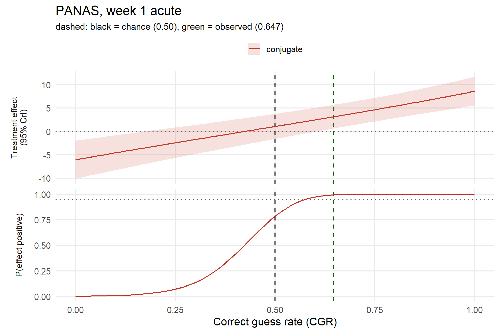

Note what the lower panel is and is not. It is \$P(\Delta(c) > 0 \mid y)\$ — the posterior probability that the reweighted contrast is positive. It is **not a p-value**, there is no line at 0.05, and the line at 0.95 is a descriptive marker, not a universal cutoff.

For outcomes where lower scores are better (QIDS, STAIT), pass `direction = -1` so favourability is declared rather than assumed.

## 10.3 The headline: two probabilities a p-value cannot give you

The plot above carries the full posterior, but a trialist reading a result wants two numbers, and a p-value only ever addresses the first:

- **Is there an effect?** \$P(\text{favourable}) = P(\text{direction}\cdot\Delta > 0)\$ — the posterior twin of a one-sided \$p\$-value.
- **Is it big enough to care?** \$P(\text{meaningful}) = P(\text{direction}\cdot\Delta > \delta)\$ — a question a \$p\$-value structurally cannot answer, because it never speaks to magnitude.

`cgrc_headline()` reports both, each **before** the blinding correction (at the observed CGR) and **after** it (at CGR \$=0.5\$), with the adjusted point estimate and 95% credible interval. There is no bright-line threshold; these are continuous probabilities, deliberately not re-collapsed into a “significant / not” verdict.

The default \$\delta\$ is **half an outcome standard deviation** — the minimum important difference Norman (2003) defends and the one Szigeti’s own 2024 escitalopram trial adopts — so “meaningful” reads as *clinically* meaningful, not merely non-zero. That is a deliberately demanding bar; `delta_sd_frac` narrows it if a smaller difference matters for a given outcome.

```r
set.seed(2)
h <- cgrc_headline(panas, direction = 1, n_draws = N_DRAWS)

# the two questions, before and after reweighting to a target CGR of 0.50
data.frame(
  question = c("P(favourable effect)", "P(meaningful, beyond delta)"),
  raw            = round(c(h$p_dir_obs,   h$p_meaningful_obs),   2),
  perfect_blind  = round(c(h$p_dir_blind, h$p_meaningful_blind), 2))
```

| question                    |  raw | perfect_blind |
|:----------------------------|-----:|--------------:|
| P(favourable effect)        | 0.99 |          0.78 |
| P(meaningful, beyond delta) | 0.07 |          0.00 |

```r
cat(h$text)
```

    ## Raw, this trial shows a 99% probability of a favourable effect and 7% that it is meaningful (beyond 5 points). Reweighted to a correct-guess rate of 0.50 (guessing at chance), those become 78% and 0% (adjusted effect 1.07, 95% CrI -1.59 to 3.79).

This is where the two questions come apart. PANAS is very likely favourable in *direction* — and the blinding correction pulls even that down, because the raw signal is inflated by the expectancy correct guessing carries. But the *size* of the effect is small against a half-SD bar, so the probability it is clinically **meaningful** is low even before correction and near zero after it. A p-value, speaking only to direction, would have reported the first number and stayed silent on the second — which is exactly the number a trialist needs.

------------------------------------------------------------------------

# 11 Sensitivity analyses

```r
set.seed(3)
priors <- list(
  "vague (default)"   = list(m0 = 0,  k0 = 1e-6, a0 = 1e-3, b0 = 1e-3),
  "weakly informative"= list(m0 = 0,  k0 = 0.01, a0 = 1,    b0 = 1),
  "informative at 0"  = list(m0 = 0,  k0 = 1,    a0 = 2,    b0 = 50),
  "unit-information"  = list(m0 = 15, k0 = 1,    a0 = 1,    b0 = 100)
)
do.call(rbind, lapply(names(priors), function(p) {
  z <- cgr_conjugate(panas, GRID, n_draws = 8000, prior = priors[[p]])
  a <- z[which.min(abs(z$cgr - 0.5)), ]
  data.frame(prior = p, adj_mean = round(a$est, 3),
             lo = round(a$lo, 3), hi = round(a$hi, 3),
             p_fav = round(a$p_fav, 3))
}))
```

| prior              | adj_mean |     lo |    hi | p_fav |
|:-------------------|---------:|-------:|------:|------:|
| vague (default)    |    1.065 | -1.593 | 3.749 | 0.782 |
| weakly informative |    1.083 | -1.575 | 3.685 | 0.793 |
| informative at 0   |    0.999 | -1.568 | 3.569 | 0.778 |
| unit-information   |    1.047 | -1.582 | 3.716 | 0.784 |

```r
# EXTENSION, not reproduction: the original estimand CONDITIONS on the observed
# within-class ratios. Treating them as uncertain is a different, larger
# uncertainty statement.
set.seed(4)
n_draws <- 8000
mu_d <- lapply(st, nig_draws, n_draws = n_draws)
rd <- cgr_ratio_draws(st, n_draws)

fixed  <- cgr_delta(0.5, mu_d, rat$r, rat$s)
random <- {
  w_acac <- 0.5 * (1 - rd$r); w_acpl <- 0.5 * rd$s
  w_plpl <- 0.5 * rd$r;       w_plac <- 0.5 * (1 - rd$s)
  (w_acac * mu_d$ACAC + w_acpl * mu_d$ACPL) / (w_acac + w_acpl) -
    (w_plpl * mu_d$PLPL + w_plac * mu_d$PLAC) / (w_plpl + w_plac)
}
data.frame(
  ratios = c("fixed (original estimand)", "Beta-uncertain (extension)"),
  mean = round(c(mean(fixed), mean(random)), 3),
  sd   = round(c(sd(fixed), sd(random)), 3),
  lo   = round(c(quantile(fixed, .025), quantile(random, .025)), 3),
  hi   = round(c(quantile(fixed, .975), quantile(random, .975)), 3),
  p_fav = round(c(mean(fixed > 0), mean(random > 0)), 3))
```

| ratios                     |  mean |    sd |     lo |    hi | p_fav |
|:---------------------------|------:|------:|-------:|------:|------:|
| fixed (original estimand)  | 1.060 | 1.359 | -1.615 | 3.713 | 0.783 |
| Beta-uncertain (extension) | 1.072 | 1.363 | -1.596 | 3.729 | 0.785 |

```r
# Small strata and skew: subsample to stress the normal within-stratum model.
set.seed(5)
do.call(rbind, lapply(c(1.0, 0.5, 0.25, 0.12), function(f) {
  idx <- sample.int(nrow(panas), max(40, round(nrow(panas) * f)))
  d <- panas[idx, ]
  ok <- tryCatch({
    z <- cgr_conjugate(d, GRID, n_draws = 6000)
    a <- z[which.min(abs(z$cgr - 0.5)), ]
    data.frame(fraction = f, n = nrow(d),
               min_stratum = min(lengths(cgr_strata(d))),
               adj = round(a$est, 3), width = round(a$hi - a$lo, 3),
               p_fav = round(a$p_fav, 3))
  }, error = function(e) data.frame(fraction = f, n = nrow(d),
      min_stratum = NA, adj = NA, width = NA, p_fav = NA))
  ok
}))
```

| fraction |   n | min_stratum |   adj |  width | p_fav |
|---------:|----:|------------:|------:|-------:|------:|
|     1.00 | 232 |          39 | 1.083 |  5.351 | 0.791 |
|     0.50 | 116 |          15 | 0.335 |  8.019 | 0.569 |
|     0.25 |  58 |           7 | 1.362 | 12.465 | 0.683 |
|     0.12 |  40 |           5 | 3.567 | 13.359 | 0.865 |

```r
# Are the strata plausibly normal? Skewness and excess kurtosis per stratum.
do.call(rbind, lapply(names(sb), function(nm) {
  s <- cgr_strata(sb[[nm]])
  do.call(rbind, lapply(STRATA, function(k) {
    x <- s[[k]]; z <- (x - mean(x)) / sd(x)
    data.frame(outcome = nm, stratum = k, n = length(x),
               skew = round(mean(z^3), 3),
               excess_kurtosis = round(mean(z^4) - 3, 3),
               sd = round(sd(x), 2))
  }))
}))
```

| outcome               | stratum |   n |   skew | excess_kurtosis |    sd |
|:----------------------|:--------|----:|-------:|----------------:|------:|
| PANAS                 | ACAC    |  48 | -0.936 |           1.418 |  8.43 |
| PANAS                 | ACPL    |  43 | -0.628 |          -0.671 | 10.73 |
| PANAS                 | PLAC    |  39 | -0.290 |          -0.627 |  7.29 |
| PANAS                 | PLPL    | 102 | -0.290 |          -0.234 |  9.80 |
| Mood VAS              | ACAC    |  48 | -0.384 |          -0.651 | 19.96 |
| Mood VAS              | ACPL    |  43 | -0.337 |          -0.929 | 23.65 |
| Mood VAS              | PLAC    |  39 |  0.170 |           0.022 | 12.43 |
| Mood VAS              | PLPL    | 102 | -0.423 |          -0.001 | 19.67 |
| Energy VAS            | ACAC    |  48 | -0.482 |          -0.429 | 18.28 |
| Energy VAS            | ACPL    |  43 |  0.188 |           0.083 | 17.27 |
| Energy VAS            | PLAC    |  39 | -0.729 |           0.503 | 15.56 |
| Energy VAS            | PLPL    | 102 | -0.376 |          -0.427 | 20.47 |
| Cognitive performance | ACAC    |  37 |  0.863 |           0.705 |  0.52 |
| Cognitive performance | ACPL    |  33 | -0.358 |          -0.105 |  0.54 |
| Cognitive performance | PLAC    |  36 | -0.240 |           0.003 |  0.51 |
| Cognitive performance | PLPL    |  80 |  0.702 |           1.561 |  0.54 |

Unequal stratum variances are handled by construction — each stratum has its own \$\sigma_j^2\$, so no homoscedasticity assumption is imposed across strata. But the skew table is not innocuous: PANAS stratum ACAC has skew \$-0.94\$ and excess kurtosis \$1.42\$, which is exactly the regime where a Gaussian likelihood’s *intervals* (not its means) can be optimistic. So the robust check is worth running rather than deferring.

A Student-\$t\$ likelihood with estimated degrees of freedom \$\nu\$ down-weights outliers and has no conjugate form, so it is reachable only through JAGS.

```r
set.seed(6)
jn <- cgr_jags(panas, likelihood = "normal", n_iter = 10000, n_chains = 4)
jt <- cgr_jags(panas, likelihood = "t",      n_iter = 10000, n_chains = 4)
i5 <- function(x) which.min(abs(x$cgr - 0.5))
data.frame(
  likelihood = c("normal", "Student-t"),
  adj_at_0.5 = round(c(jn$est[i5(jn)], jt$est[i5(jt)]), 3),
  cri_95 = c(sprintf("[%.2f, %.2f]", jn$lo[i5(jn)], jn$hi[i5(jn)]),
             sprintf("[%.2f, %.2f]", jt$lo[i5(jt)], jt$hi[i5(jt)])),
  P_positive = round(c(jn$p_fav[i5(jn)], jt$p_fav[i5(jt)]), 3),
  est_df_nu = c(NA, round(attr(jt, "nu"), 1)))
```

| likelihood | adj_at_0.5 | cri_95          | P_positive | est_df_nu |
|:-----------|-----------:|:----------------|-----------:|----------:|
| normal     |      1.077 | [-1.57, 3.72] |       0.79 |        NA |
| Student-t  |      1.355 | [-1.30, 4.03] |       0.84 |      18.4 |

A **small** \$\nu\$ (say under 10) would mean the data are genuinely heavier-tailed than Gaussian and the robust fit is doing real work; a **large** \$\nu\$ means the \$t\$ collapsed back toward the normal. Here \$\nu \approx 18\$, so the tails are only mildly heavy.

**But read the point estimate before concluding “no change”.** The adjusted estimate moves from 1.077 (normal) to ~1.355 (Student-\$t\$) — a **~26% shift** in the headline number. That is not negligible for the *attenuation* summary reported elsewhere: under the normal likelihood PANAS attenuates \$3.15 \to 1.08 \approx 66\\$, but under the Student-\$t\$ it is \$3.15 \to 1.355 \approx 57\\$. So the percentage attenuation is **likelihood-dependent** and should not be quoted as a single fixed number.

What *does* survive the switch is the **inference**: the two posteriors differ by only ~0.2 of a posterior SD, their 95% credible intervals overlap heavily, and \$P(\text{effect} > 0)\$ moves only from 0.79 to 0.84. So the qualitative conclusion — a positive effect that is much attenuated but not clearly zero — holds under both likelihoods; it is the exact attenuation *percentage* that is not robust, not the direction.

------------------------------------------------------------------------

# 12 A region of practical equivalence

The lower panel of Section 10 reports \$P(\Delta(c) > 0 \mid y)\$. As an inferential summary a direction probability — like the two-sided tail it replaced — has two defects. It is **magnitude-blind**: a tiny, precisely estimated effect and a large, uncertain one can score identically. And it **conflates two states of knowledge**: a probability near 0.5 can mean “the posterior is concentrated near zero, so the effect is negligible” or “the posterior is diffuse, so we have learned nothing” — opposite conclusions the statistic cannot separate. For a method whose whole purpose is asking whether an apparent effect *survives* adjustment, that is the distinction that matters.

The fix is not a Bayes factor against \$\Delta = 0\$: with the vague default prior (\$k_0 = 10^{-6}\$) it depends on the prior width without limit — the Jeffreys–Lindley paradox — so it would measure the prior, not the data. Instead declare a band \$[-\delta, +\delta]\$ of practically-negligible effects and report the three exhaustive probabilities

\$\$P(\Delta \< -\delta), \qquad P(\|\Delta\| \le \delta), \qquad P(\Delta \> +\delta),\$\$

which sum to 1 and whose middle term separates “negligible” from “uninformative”. The cost — \$\delta\$ must be declared — is a feature: it forces the practical-significance question into the open. The default is \$\delta = 0.1 \times\$ the outcome’s pooled SD.

```r
set.seed(31)
rope <- lapply(sb, cgr_rope, n_draws = N_DRAWS, direction = 1)
do.call(rbind, lapply(names(sb), function(nm) {
  z <- rope[[nm]]; o <- cgr_observed(cgr_strata(sb[[nm]]))
  do.call(rbind, lapply(list(c(o, 0), c(0.5, 1)), function(tt) {
    a <- z[which.min(abs(z$cgr - tt[1])), ]
    data.frame(outcome = nm,
               at = if (tt[2] == 0) "observed CGR" else "CGR 0.50",
               ROPE_delta = round(a$delta, 2),
               post_mean = round(a$est, 3),
               P_harm = round(a$p_harm, 3),
               P_negligible = round(a$p_negligible, 3),
               P_benefit = round(a$p_benefit, 3))
  }))
}))
```

| outcome               | at           | ROPE_delta | post_mean | P_harm | P_negligible | P_benefit |
|:----------------------|:-------------|-----------:|----------:|-------:|-------------:|----------:|
| PANAS                 | observed CGR |       1.00 |     3.195 |  0.001 |        0.043 |     0.956 |
| PANAS                 | CGR 0.50     |       1.00 |     1.068 |  0.062 |        0.421 |     0.517 |
| Mood VAS              | observed CGR |       2.07 |     6.423 |  0.001 |        0.057 |     0.942 |
| Mood VAS              | CGR 0.50     |       2.07 |     2.516 |  0.056 |        0.386 |     0.558 |
| Energy VAS            | observed CGR |       2.07 |    11.469 |  0.000 |        0.000 |     1.000 |
| Energy VAS            | CGR 0.50     |       2.07 |     7.095 |  0.000 |        0.021 |     0.978 |
| Cognitive performance | observed CGR |       0.05 |    -0.010 |  0.302 |        0.476 |     0.222 |
| Cognitive performance | CGR 0.50     |       0.05 |     0.006 |  0.241 |        0.468 |     0.291 |

Read the `CGR 0.50` rows. For **PANAS**, adjustment leaves roughly a 40% chance the effect is practically negligible against roughly a 50% chance it is meaningfully positive — genuine uncertainty, not a demonstrated null; reporting “not significant” there would be a misreading. For **Energy VAS**, the probability of a meaningful benefit stays high even after adjustment. For **cognitive performance**, the mass is spread across all three regions — the honest description of a small study with a small ROPE: uninformative rather than null.

```r
stack <- do.call(rbind, lapply(names(sb), function(nm) {
  z <- rope[[nm]]
  do.call(rbind, lapply(c("p_benefit", "p_negligible", "p_harm"), function(k)
    data.frame(cgr = z$cgr, outcome = nm, p = z[[k]], region = k,
               obs = cgr_observed(cgr_strata(sb[[nm]])))))
}))
stack$outcome <- factor(stack$outcome, levels = names(SCALES))
stack$region  <- factor(stack$region,
  levels = c("p_benefit", "p_negligible", "p_harm"),
  labels = c("meaningful benefit", "practically negligible", "meaningful harm"))

ggplot(stack, aes(cgr, p, fill = region)) +
  geom_area(position = "stack") +
  geom_vline(xintercept = 0.5, linetype = "dashed", colour = "black") +
  geom_vline(aes(xintercept = obs), linetype = "dashed", colour = "darkgreen") +
  scale_fill_manual(values = c("meaningful benefit" = "#2471A3",
                               "practically negligible" = "grey75",
                               "meaningful harm" = "#C0392B")) +
  scale_y_continuous(expand = c(0, 0)) +
  facet_wrap(~ outcome, nrow = 1) +
  labs(x = "Correct guess rate (CGR)", y = "posterior probability", fill = NULL,
       title = "ROPE decomposition of the CGR-adjusted effect",
       subtitle = paste("regions are exhaustive and sum to 1 at every CGR;",
                        "black = target CGR 0.50 (guessing at chance), green = observed CGR")) +
  theme_minimal(base_size = 10) +
  theme(legend.position = "bottom", panel.grid.minor = element_blank())
```

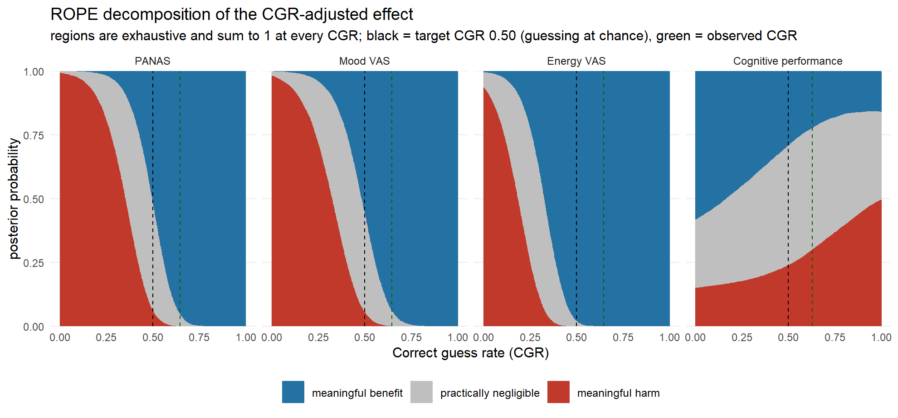

**Sensitivity to the width.** A region-based conclusion is only as robust as the region, so vary \$\delta\$ from 0.05 to 0.30 SD at CGR 0.50:

```r
set.seed(41)
do.call(rbind, lapply(names(sb), function(nm) {
  s <- cgr_rope_sensitivity(sb[[nm]], at_cgr = 0.5, n_draws = 12000)
  data.frame(outcome = nm, delta_in_SD = s$delta_in_SD,
             delta = round(s$delta, 2),
             P_negligible = round(s$p_negligible, 3),
             P_benefit = round(s$p_benefit, 3))
}))
```

| outcome               | delta_in_SD | delta | P_negligible | P_benefit |
|:----------------------|------------:|------:|-------------:|----------:|
| PANAS                 |        0.05 |  0.50 |        0.215 |     0.662 |
| PANAS                 |        0.10 |  1.00 |        0.414 |     0.523 |
| PANAS                 |        0.20 |  2.00 |        0.740 |     0.247 |
| PANAS                 |        0.30 |  3.00 |        0.925 |     0.073 |
| Mood VAS              |        0.05 |  1.04 |        0.194 |     0.702 |
| Mood VAS              |        0.10 |  2.07 |        0.377 |     0.567 |
| Mood VAS              |        0.20 |  4.14 |        0.712 |     0.279 |
| Mood VAS              |        0.30 |  6.21 |        0.903 |     0.096 |
| Energy VAS            |        0.05 |  1.03 |        0.007 |     0.993 |
| Energy VAS            |        0.10 |  2.07 |        0.020 |     0.980 |
| Energy VAS            |        0.20 |  4.13 |        0.117 |     0.883 |
| Energy VAS            |        0.30 |  6.20 |        0.364 |     0.636 |
| Cognitive performance |        0.05 |  0.03 |        0.249 |     0.403 |
| Cognitive performance |        0.10 |  0.05 |        0.473 |     0.285 |
| Cognitive performance |        0.20 |  0.11 |        0.796 |     0.113 |
| Cognitive performance |        0.30 |  0.16 |        0.938 |     0.036 |

Energy VAS is the only outcome whose conclusion is stable across every width — the probability of a meaningful benefit stays high even at \$\delta = 0.3\$ SD. PANAS and Mood VAS flip from “probably meaningful” to “probably negligible” as \$\delta\$ widens, exactly the fragility a single tail number would have concealed.

------------------------------------------------------------------------

# 13 Extension for UNKNOWN treatment guesses

> **This section documents an extension implemented by `cgrc.bayes`. It is not part of the original CGRC formulation of Szigeti et al., and nothing above changes.** The binary four-stratum estimand, its posterior, and all published results are unaffected; the extension lives entirely in new functions.

Real trials often let a participant answer **“I do not know”** to the guess question. Dropping those participants, or coding them as incorrect guesses or as placebo, invents information the trial never collected. The extension keeps UNKNOWN as an observed third response category using **six strata** (\$\text{ACAC}, \text{ACPL}, \text{ACU}, \text{PLAC}, \text{PLPL}, \text{PLU}\$, arm \$\times\$ guess with \$= \$ UNKNOWN).

## 13.1 The six-stratum estimand

Write \$u\$ for the UNKNOWN-response rate and \$c\$ for the **directional** correct-guess rate — the correct-guess rate *among participants who gave an AC/PL guess*. With the observed within-class arm shares \$r = \text{PLPL}/(\text{PLPL}+\text{ACAC})\$, \$s = \text{ACPL}/(\text{ACPL}+\text{PLAC})\$ and \$t = \text{ACU}/(\text{ACU}+\text{PLU})\$, the six weights at target \$(c, u)\$ are

\$\$\begin{aligned} w\_{\text{ACAC}} &= (1-u)\\c\\(1-r), & w\_{\text{PLPL}} &= (1-u)\\c\\r, \\ w\_{\text{ACPL}} &= (1-u)(1-c)\\s, & w\_{\text{PLAC}} &= (1-u)(1-c)(1-s), \\ w\_{\text{ACU}} &= u\\t, & w\_{\text{PLU}} &= u\\(1-t), \end{aligned}\$\$

which sum to one; the correct class carries mass \$(1-u)c\$, the incorrect class \$(1-u)(1-c)\$, and the UNKNOWN class \$u\$. The contrast is \$\Delta(c,u) = \mu_{\text{AC}}(c,u) - \mu_{\text{PL}}(c,u)\$, each arm mean being the weight-averaged stratum mean within that arm. The default analysis holds \$u = u_{\text{obs}}\$ and varies \$c\$; the primary adjusted estimate is \$\Delta(0.50,\ u_{\text{obs}})\$ — *directional guessing at chance while holding the observed UNKNOWN-response rate fixed*, which is **not** the same as “perfect blinding”.

## 13.2 Two exact properties

**Observed-value identity.** At \$(c_{\text{obs}}, u_{\text{obs}})\$ each within-arm weight reduces to \$n_{\text{stratum}}/n_{\text{total}}\$, so \$\Delta(c_{\text{obs}}, u_{\text{obs}})\$ equals the raw active\$-\$placebo mean difference. **Reduction.** At \$u = 0\$ every weight collapses to the four-stratum \$w\$, so \$\Delta(c, 0)\$ equals the binary `cgr_delta(c, ...)` exactly. Both are checked here on a simulated six-stratum trial:

```r
# a simulated six-stratum trial with an UNKNOWN response category
set.seed(20260724)
mk_unknown <- function(counts, arm_shift = 2, sd = 3) {
  do.call(rbind, Map(function(nm, k) {
    if (k == 0) return(NULL)
    cond <- substr(nm, 1, 2); g <- substring(nm, 3); g <- ifelse(g == "U", "UNKNOWN", g)
    data.frame(condition = cond, guess = g,
               value = rnorm(k, 10 + (cond == "AC") * arm_shift, sd))
  }, names(counts), counts))
}
d_u  <- mk_unknown(c(ACAC = 40, ACPL = 18, ACU = 22, PLAC = 20, PLPL = 34, PLU = 16))
st_u <- cgr_unknown_strata(d_u); o_u <- cgr_unknown_observed(st_u)
rat  <- cgr_unknown_ratios(st_u)
mu_u <- setNames(lapply(UNKNOWN_STRATA, function(nm) mean(st_u[[nm]])), UNKNOWN_STRATA)

identity_gap <- cgr_unknown_delta(o_u$c_obs, o_u$u_obs, mu_u, rat$r, rat$s, rat$t) -
  (mean(d_u$value[d_u$condition == "AC"]) - mean(d_u$value[d_u$condition == "PL"]))

# reduction at u = 0 against the binary estimand on a binary trial
d_bin <- sim_aeb(400, 0.7, dte_on = TRUE)
stb <- cgr_strata(d_bin); ratb <- cgr_ratios(stb); mub <- lapply(stb, mean)
stu <- cgr_unknown_strata(d_bin); ratu <- cgr_unknown_ratios(stu)
muu <- setNames(lapply(UNKNOWN_STRATA,
  function(nm) if (length(stu[[nm]])) mean(stu[[nm]]) else NA_real_), UNKNOWN_STRATA)
reduction_gap <- max(abs(vapply(GRID, function(cc)
  cgr_unknown_delta(cc, 0, muu, ratu$r, ratu$s, ratu$t) - cgr_delta(cc, mub, ratb$r, ratb$s),
  numeric(1))))

cat(sprintf("observed-value identity gap : %.2e\n", abs(identity_gap)))
```

    ## observed-value identity gap : 3.55e-15

```r
cat(sprintf("max reduction gap at u = 0  : %.2e\n", reduction_gap))
```

    ## max reduction gap at u = 0  : 3.55e-15

## 13.3 Reproducing two audited count structures

The extension must reproduce these count tables exactly (they are validation targets for the *counts*, not results to interpret):

```r
tab <- function(counts, label) {
  o <- cgr_unknown_observed(cgr_unknown_strata(mk_unknown(counts)))
  data.frame(trial = label, n_total = o$n_total, n_unknown = o$n_unknown,
             u_obs = round(o$u_obs, 4), n_directional = o$n_directional,
             c_obs = round(o$c_obs, 4))
}
rbind(
  tab(c(ACAC = 26, ACPL = 1, ACU = 12, PLAC = 21, PLPL = 3, PLU = 14), "Santana-Penin (n=77)"),
  tab(c(ACAC = 9,  ACPL = 5, ACU = 5,  PLAC = 8,  PLPL = 5, PLU = 6),  "ketamine (n=38)"))
```

| trial                | n_total | n_unknown |  u_obs | n_directional |  c_obs |
|:---------------------|--------:|----------:|-------:|--------------:|-------:|
| Santana-Penin (n=77) |      77 |        26 | 0.3377 |            51 | 0.5686 |
| ketamine (n=38)      |      38 |        11 | 0.2895 |            27 | 0.5185 |

Santana-Penin gives \$u = 26/77 = 0.338\$ and directional \$c = 29/51 = 0.569\$; the ketamine belief subsample gives \$u = 11/38 = 0.289\$ and \$c = 14/27 = 0.519\$.

## 13.4 Adjusted analysis and backend agreement

```r
fit_u <- cgrc_unknown(d_u, n_draws = N_DRAWS, seed = 1)
fit_u$summary
```

| directional_cgr | unknown_rate | what                                           | post_mean | cri_lo | cri_hi | p_favourable | abs_attenuation | pct_attenuation |
|----------------:|-------------:|:-----------------------------------------------|----------:|-------:|-------:|-------------:|----------------:|----------------:|
|          0.6607 |       0.2533 | observed (unadjusted)                          |     0.963 | -0.032 |  1.955 |        0.972 |              NA |              NA |
|          0.5000 |       0.2533 | directional CGR 0.50 (UNKNOWN rate held fixed) |     0.974 | -0.041 |  1.997 |        0.970 |          -0.011 |              NA |

```r
chk <- cgr_unknown_check_backends(d_u, grid = seq(0, 1, length.out = 21),
                                  n_draws = 30000,
                                  jags_args = list(n_iter = 6000, n_burn = 1500, n_chains = 4))
cat(sprintf("UNKNOWN conjugate vs JAGS: max|z| = %.2f, max Rhat = %.4f, min ESS = %.0f\n%s\n",
            chk$max_abs_z, chk$max_rhat, chk$min_ess, chk$verdict))
```

    ## UNKNOWN conjugate vs JAGS: max|z| = 1.15, max Rhat = 1.0002, min ESS = 23654
    ## PASS - UNKNOWN-extension backends agree within Monte Carlo error

The x-axis of the extension’s curve is the **directional** correct-guess rate, and the held UNKNOWN rate is stated in the caption — the labels never imply the x-axis is the overall correct-guess rate:

```r
plot(fit_u)
```

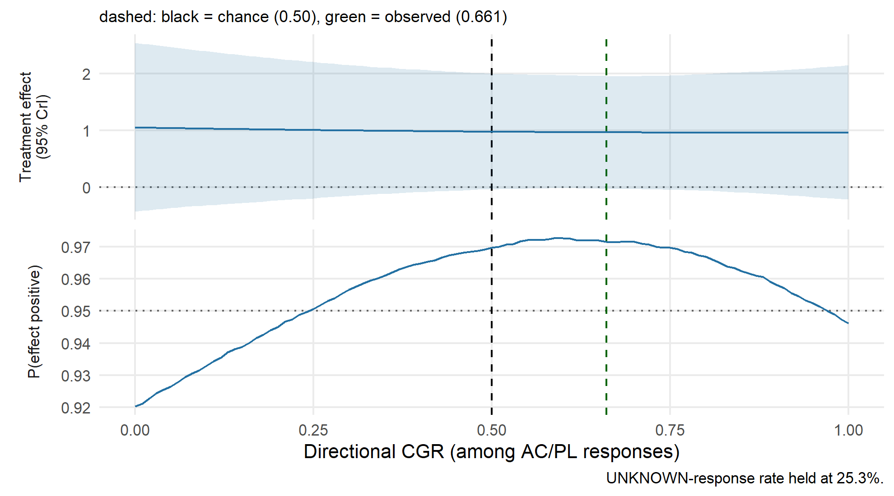

## 13.5 Operating characteristics under an explicit UNKNOWN model

Does the six-stratum estimator actually recover the direct effect? To ask that we need a generative model that *emits* UNKNOWN responses. `sim_aeb_unknown()` extends the AEB model under two explicit assumptions: **(A1)** the UNKNOWN-response rate is equal in both arms, and **(A2)** an UNKNOWN responder carries no expectancy (no directional belief, so the perceived-treatment \$\rightarrow\$ expectancy path is absent). `cgr_unknown_operating()` is then the six-stratum analogue of `cgr_operating()`.

```r
oc <- cgr_unknown_operating(n_trials = 300, n = 300, p_cg = 0.7, u = 0.25, seed = 1)
oc[, c("DTE","AEB","true","adj_bias","coverage95","p_fav_gt_95","freq_sig","empty_stratum_rate")]
```

| DTE | AEB | true |   adj_bias | coverage95 | p_fav_gt_95 |  freq_sig | empty_stratum_rate |
|----:|----:|-----:|-----------:|-----------:|------------:|----------:|-------------------:|
|   0 |   0 |    0 |  0.0322874 |  0.9533333 |   0.0466667 | 0.0366667 |                  0 |
|   1 |   0 |    3 | -0.0501841 |  0.9633333 |   0.9500000 | 0.9533333 |                  0 |
|   0 |   1 |    0 |  0.0370478 |  0.9600000 |   0.0566667 | 0.7266667 |                  0 |
|   1 |   1 |    3 | -0.0170283 |  0.9566667 |   0.7900000 | 1.0000000 |                  0 |

Under A1/A2 the estimator of \$\Delta(0.50, u_{\text{obs}})\$ is essentially unbiased for the direct effect (\|bias\| well under 0.1) with 95% coverage near 0.95 in all four scenarios; and in the **pure-expectancy** row (a real effect of zero, expectancy on) the adjusted analysis flags a favourable effect only ~5% of the time while the naive \$t\$-test is driven to ~70% by expectancy — the six- stratum adjustment removes the inflation just as the binary one does.

## 13.6 What this extension does and does not claim

It **preserves** the observed UNKNOWN responses and the observed within-class arm ratios \$r, s, t\$ while varying class mass — the same logic as the binary CGRC. It does **not** prove that treatment assignment and all three guess categories are independent; \$t\$ is an assumption exactly as \$r, s\$ are, and `c = 0.50` is directional guessing at chance, not proven perfect blinding. The operating characteristics above are validation **under A1 and A2** — not a claim that the extension beats the binary method in general, nor that A1/A2 hold in any real trial; differential UNKNOWN rates and expectancy-carrying UNKNOWN responders are not yet characterised, and the six strata are thinner than four so degenerate designs appear sooner (see `reports/UNRESOLVED.md`, U10). Optional, default-off sensitivities — `ratio_uncertainty` (propagate \$r,s,t\$), `pooling = "partial"` (hierarchical), and `cgr_unknown_independent()` (a separate shared-guess- distribution estimand) — are provided to probe those assumptions, not to settle them.

------------------------------------------------------------------------

# 14 Assumptions and limitations

**This is a sensitivity analysis. It does not identify a direct pharmacological effect.**

1.  **Malicious versus benign unblinding.** The method assumes unblinding is *malicious*: side effects reveal allocation, and expectancy then drives outcome (PT → TE → OUT). If unblinding is *benign* — people guess correctly *because* they improved — the causal arrow runs OUT → PT, and CGR adjustment removes a genuine treatment effect. **The original paper warns about this explicitly and it must be preserved prominently.** The authors argue for malicious unblinding here on the grounds that 55% cited bodily sensations versus 23% citing mental benefits, and that the placebo-microdose difference is small relative to natural day-to-day variability. That is an argument from evidence, not a demonstration.
2.  **Collider bias.** Guess is a downstream consequence of both treatment and outcome. Conditioning on it can induce association where none exists.
3.  **Transportability.** The four observed strata are assumed to represent the corresponding strata in a hypothetical perfectly blinded population. People who guess correctly under poor blinding may not be exchangeable with those who would guess correctly by chance under good blinding.
4.  **Conditioning on observed guess behaviour.** The estimand holds \$r\$ and \$s\$ fixed at their observed values, treating stratum composition as known rather than estimated (Section 11 quantifies the alternative).
5.  **Normality within stratum.** Bounded scales with floor/ceiling effects are not exactly normal (Section 11 reports skew and kurtosis).
6.  **Small strata.** ACPL and PLAC hold 39–43 observations for PANAS. Cognitive scales have fewer still.
7.  **Binary guess.** Treatment belief is reduced to one bit, with no confidence rating, so a confident correct guess and a lucky one are indistinguishable.
8.  **Association is not causation.** Removing an association between outcome and guessing is not the same as removing expectancy causally.
9.  **Attenuation is not an effect decomposition.** The gap between \$\Delta(c_{obs})\$ and \$\Delta(0.5)\$ is *not* a measurement of “how much was expectancy”. It is the change in the estimand under a reweighting assumption.
10. **Reproducing the curve does not validate the assumptions.** It validates the arithmetic.

------------------------------------------------------------------------

# 15 What the Bayesian approach adds

Stated narrowly, because Section 8 showed both approaches target the same estimand.

**What it adds:**

- **A quantity with an interpretation.** \$P(\Delta(0.5) > 0 \mid y)\$ is a probability statement about the parameter under the model. An average of 100 p-values is not a p-value for anything.
- **Removal of an artefactual error term.** The 0.12–0.29 point Monte Carlo SE from 100 resamples is a property of the computation, not the trial. The conjugate posterior is exact.
- **Direct uncertainty propagation.** The credible interval comes from the same object as the point estimate, rather than being assembled from resampled fits.
- **Extensibility.** Robust likelihoods, uncertain ratios, and hierarchical structure are reachable in the same framework.
- **Calibration that has been checked.** Section 9 measured coverage rather than assuming it.

**What it does not add:**

- No extra information about participants. `n_draws` is not a sample size.
- No relaxation of any causal assumption in Section 12.
- No demonstrated superiority over the KDE procedure as an estimator, since both converge to the same value.

------------------------------------------------------------------------

# 16 Using this on your own trial

Szigeti et al. (2023) close their limitations with a request:

> “Researchers wishing to use CGR adjustment should first run simulations to determine whether CGR produces acceptable error rates for the parameters of their data and the application in mind.”

That tool is `cgr_operating()`, and it is why this is a package rather than a one-off script. Two calls cover both halves of that sentence — adjust your trial, and first check whether the adjustment is even trustworthy for *your* design:

```r
library(cgrc.bayes)

# 1. Adjust your own trial. `my_trial` needs three columns: condition (AC/PL),
#    guess (AC/PL), value. Returns the curve, the estimate at target CGR 0.50
#    (CGR 0.50) and the posterior probability the effect is favourable.
cgrc(my_trial)

# 2. "...first run simulations to determine whether CGR produces acceptable
#    error rates for the parameters of my data": bias, RMSE, 95% coverage and
#    false-favourable rate at MY sample size, guess rate and effect size.
cgr_operating(n = 120, p_cg = 0.85, n_trials = 500)
```

The first line gives the adjusted estimate; the second answers whether CGR adjustment is safe to apply at all for a trial of that size and blinding quality — Section 9 ran exactly this at \$n = 230\$, and it is where you would check that coverage is near 0.95 and the false-favourable rate is controlled before trusting the adjustment on your own data. Installation, the JAGS backend, the robust likelihood, the ROPE summary and the full function list live in the repository README; this section is only the front door.

------------------------------------------------------------------------

# 17 External validation: three independent trials

The microdose data above are the study this method was built on. To see how the tool behaves on *other* trials — and to exercise the UNKNOWN-preserving extension on real “I do not know” responses — this section runs three further public, audited datasets through exactly the pipeline the Shiny app’s *Analyse your own trial* panel uses: an input audit, then either the binary four-stratum `cgrc()` or the six-stratum `cgrc_unknown()` when UNKNOWN guesses are present. Provenance, transformations and per-study caveats are in `inst/extdata/external_studies/PROVENANCE.txt`; the counts below reproduce the shipped audit summary.

| Trial                       | Design                         | Guess structure        | Outcome (direction)                                           |
|-----------------------------|--------------------------------|------------------------|---------------------------------------------------------------|
| Cavanna et al. (2022)       | psilocybin microdosing         | binary (reconstructed) | well-being; dosing-day VAS positive control (higher = better) |
| Santana-Penín et al. (2023) | sham dental therapy            | AC / PL / UNKNOWN      | 6-month ITT pain improvement, MID 1.5 (higher = better)       |
| Lii et al. (2023)           | ketamine masked by anaesthesia | AC / PL / UNKNOWN      | mean MADRS Days 1–3 (lower = better)                          |

```r
# Resolve a dataset by name. The working directory is tried FIRST (drop the CSVs
# next to this file / into your session's wd), then the repo layout, then an
# installed package copy. Expected names: cavanna_cgrc.csv, santana_cgrc_unk.csv,
# ketamine_cgrc_unk.csv.
read_ext <- function(f) {
  cand <- c(f,                                               # working directory
            file.path("inst/extdata/external_studies", f),   # repo layout
            system.file("extdata", "external_studies", f, package = "cgrc.bayes"))
  for (p in cand) if (nzchar(p) && file.exists(p))
    return(utils::read.csv(p, stringsAsFactors = FALSE))
  stop("external study file not found: ", f)
}

# Mirror the app's *Analyse your own trial* panel: audit every row, then run the
# binary or the UNKNOWN-preserving analysis. `force_binary` reproduces the
# complete-case path (UNKNOWN responses excluded) for contrast.
app_analyse <- function(df, condc, guessc, valc, direction = 1, delta = NULL,
                        delta_sd_frac = 0.5, force_binary = FALSE, n_draws = 8000) {
  aud   <- cgrc_input_audit(df[[condc]], df[[guessc]], df[[valc]])
  clean <- aud$clean
  mode  <- if (aud$has_unknown && !force_binary) "unknown" else "binary"
  if (mode == "binary") clean <- clean[clean$guess %in% c("AC", "PL"), , drop = FALSE]
  d <- if (!is.null(delta)) delta else delta_sd_frac * stats::sd(clean$value)
  fit <- if (mode == "unknown")
           cgrc_unknown(clean, n_draws = n_draws, direction = direction, seed = 1)
         else cgrc(clean, n_draws = n_draws, direction = direction, seed = 1)
  hd  <- if (mode == "unknown")
           cgrc_unknown_headline(clean, direction = direction, delta = d, n_draws = n_draws, seed = 1)
         else cgrc_headline(clean, direction = direction, delta = d, n_draws = n_draws, seed = 1)
  rp  <- tryCatch(
    if (mode == "unknown")
      cgr_unknown_rope(clean, grid = seq(0, 1, length.out = 101), n_draws = n_draws,
                       delta = d, direction = direction)
    else
      cgr_rope(clean, grid = seq(0, 1, length.out = 101), n_draws = n_draws,
               delta = d, direction = direction),
    error = function(e) NULL)
  list(mode = mode, audit = aud, trial = clean, dir = direction, delta = d,
       fit = fit, head = hd, rope = rp)
}

# the app's Panel B CGR curve (effect + P(favourable) facets)
app_curve <- function(a, label) {
  if (a$mode == "unknown") {
    cgr_unknown_plot(a$fit$curve, obs_cgr = a$fit$observed_directional_cgr,
                     u = a$fit$target_unknown_rate, direction_label = label)
  } else {
    cgr_plot(a$fit$curve, obs_cgr = a$fit$observed_cgr, direction_label = label)
  }
}

# the app's compact "at a glance" summary
app_summary <- function(a) {
  s   <- a$fit$summary
  ocg <- if (a$mode == "unknown") a$fit$observed_directional_cgr else a$fit$observed_cgr
  pct <- function(p) sprintf("%.0f%%", 100 * p)
  data.frame(
    Quantity = c("Analysed n", "Observed correct-guess rate",
                 "Raw effect (at observed CGR)", "Adjusted effect (CGR 0.50)",
                 "Adjusted 95% CrI", "P(favourable): raw → adjusted",
                 sprintf("P(exceeds %.3g-unit threshold): raw → adjusted", a$delta)),
    Value = c(as.character(nrow(a$trial)), sprintf("%.3f", ocg),
              sprintf("%.2f", s$post_mean[1]), sprintf("%.2f", s$post_mean[2]),
              sprintf("[%.2f, %.2f]", s$cri_lo[2], s$cri_hi[2]),
              paste(pct(s$p_favourable[1]), "→", pct(s$p_favourable[2])),
              paste(pct(a$head$p_meaningful_obs), "→", pct(a$head$p_meaningful_blind))),
    check.names = FALSE)
}

# the app's region-of-practical-equivalence view: how the posterior splits into
# meaningful benefit / practically negligible / meaningful harm across the CGR
# grid, at the study's meaningful-difference threshold (delta).
app_rope <- function(a, xlab = "correct-guess rate (CGR)") {
  z   <- a$rope
  obs <- if (a$mode == "unknown") a$fit$observed_directional_cgr else a$fit$observed_cgr
  stack <- do.call(rbind, lapply(c("p_benefit", "p_negligible", "p_harm"), function(k)
    data.frame(cgr = z$cgr, p = z[[k]], region = k)))
  stack$region <- factor(stack$region, c("p_benefit", "p_negligible", "p_harm"),
    labels = c("meaningful benefit", "practically negligible", "meaningful harm"))
  ggplot(stack, aes(cgr, p, fill = region)) +
    geom_area() +
    geom_vline(xintercept = 0.5, linetype = "dashed") +
    geom_vline(xintercept = obs, linetype = "dashed", colour = "darkgreen") +
    scale_fill_manual(values = c("meaningful benefit" = "#2471A3",
      "practically negligible" = "grey75", "meaningful harm" = "#C0392B")) +
    scale_y_continuous(expand = c(0, 0)) +
    labs(x = xlab, y = "posterior probability", fill = NULL,
         subtitle = sprintf("split at delta = %.3g outcome units; dashed green = observed CGR",
                            a$delta)) +
    theme_minimal(base_size = 13) +
    theme(legend.position = "bottom",
          plot.subtitle = element_text(size = rel(0.85)))
}
```

## 17.1 Cavanna et al. (2022): psilocybin microdosing — binary

A 34-participant double-blind crossover; Week 1 only is used, giving one record per participant. The treatment guess is *reconstructed* from a correctness indicator under a forced active-vs-placebo choice, so read this as an illustration of the binary path on an independent trial rather than a definitive re-analysis. All four strata are populated.

```r
cav     <- read_ext("cavanna_cgrc.csv")
cav_wb  <- app_analyse(cav, "treatment_received", "treatment_guessed",
                       "psychological_wellbeing", direction = 1)
cav_vas <- app_analyse(cav, "treatment_received", "treatment_guessed",
                       "vas_dose_days", direction = 1)
st <- cgr_strata(cav_wb$trial); gr <- cgr_guess_rates(cav_wb$trial)
knitr::kable(data.frame(stratum = STRATA, n = lengths(st)[STRATA]),
  caption = sprintf("Cavanna Week-1 strata; observed CGR %.3f (active-arm %.0f%%, placebo-arm %.0f%% correct)",
                    cav_wb$fit$observed_cgr, 100 * gr$active, 100 * gr$placebo))
```

|      | stratum |   n |
|:-----|:--------|----:|
| ACAC | ACAC    |  11 |
| ACPL | ACPL    |   7 |
| PLAC | PLAC    |   8 |
| PLPL | PLPL    |   8 |

Cavanna Week-1 strata; observed CGR 0.559 (active-arm 61%, placebo-arm 50% correct)

```r
knitr::kable(app_summary(cav_wb), caption = "Cavanna — psychological well-being (higher is better)")
```

| Quantity                                        | Value           |
|:------------------------------------------------|:----------------|
| Analysed n                                      | 34              |
| Observed correct-guess rate                     | 0.559           |
| Raw effect (at observed CGR)                    | -0.20           |
| Adjusted effect (CGR 0.50)                      | -0.16           |
| Adjusted 95% CrI                                | [-0.95, 0.62] |
| P(favourable): raw → adjusted                   | 28% → 33%       |
| P(exceeds 0.481-unit threshold): raw → adjusted | 3% → 5%         |

Cavanna — psychological well-being (higher is better)

```r
app_curve(cav_wb, "positive")
```

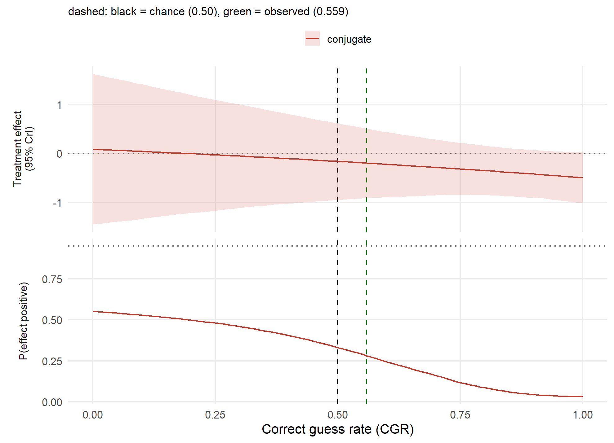

```r
knitr::kable(app_summary(cav_vas), caption = "Cavanna — dosing-day acute-effect VAS (positive control)")
```

| Quantity                                       | Value            |
|:-----------------------------------------------|:-----------------|
| Analysed n                                     | 34               |
| Observed correct-guess rate                    | 0.559            |
| Raw effect (at observed CGR)                   | 11.11            |
| Adjusted effect (CGR 0.50)                     | 10.14            |
| Adjusted 95% CrI                               | [-4.61, 24.56] |
| P(favourable): raw → adjusted                  | 95% → 92%        |
| P(exceeds 9.51-unit threshold): raw → adjusted | 60% → 54%        |

Cavanna — dosing-day acute-effect VAS (positive control)

```r
app_curve(cav_vas, "positive")
```

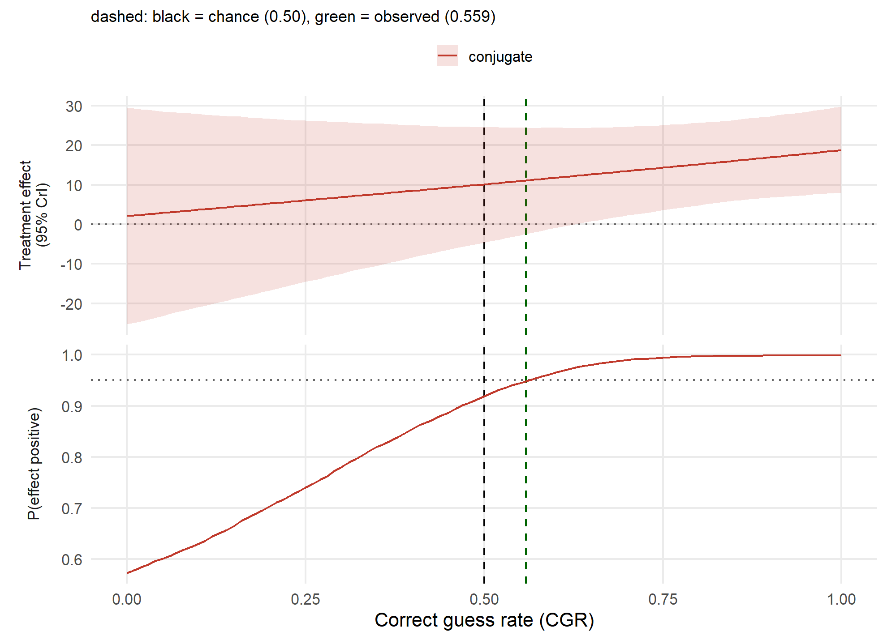

The region-of-practical-equivalence view sharpens the positive control: it asks not just whether the VAS effect is above zero but whether it clears a half-SD meaningful-difference band. At the observed CGR most of the posterior sits in **meaningful benefit**, so the acute effect is large, not merely non-zero.

```r
app_rope(cav_vas)
```

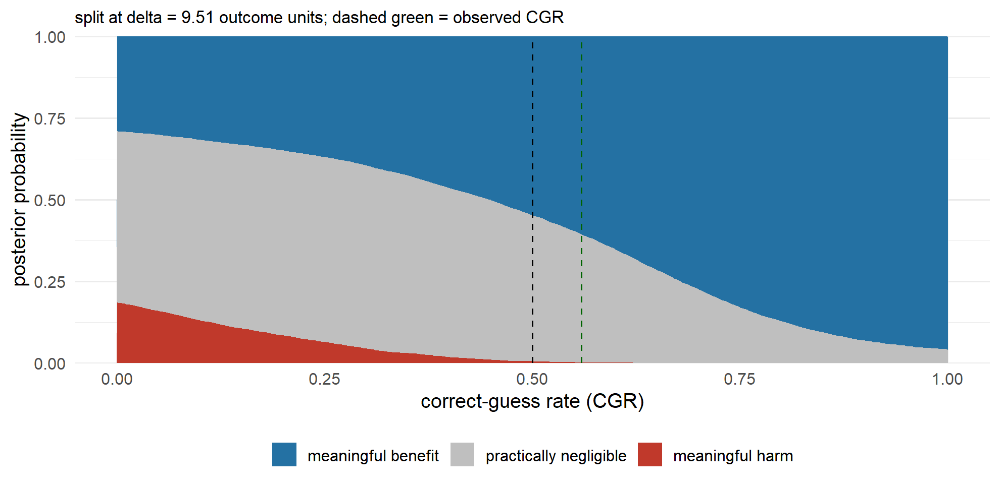

Well-being shows nothing to adjust: a raw active-minus-placebo difference near zero with P(favourable) only 28%, essentially unchanged at perfect blinding (33%). The dosing-day VAS — the positive control — is the opposite: a raw effect of 11.1 points with P(favourable) 95%, and it *survives* CGR adjustment (92% at CGR 0.50). A real acute pharmacological signal that reweighting does not explain away — but note the primary caveat: a genuine acute effect can itself drive the correct guess, so here low attenuation is *expected* and is not by itself evidence that expectancy was absent.

## 17.2 Santana-Penín et al. (2023): sham-controlled dental therapy — UNKNOWN

77 adults with chronic temporomandibular pain; assignment awareness at six months was recorded as *real therapy*, *I do not know*, or *placebo therapy*. Positive `pain_improvement_6m_itt` means improvement, and the README fixes the clinically important difference at 1.5 points.

```r
san_df  <- read_ext("santana_cgrc_unk.csv")
san     <- app_analyse(san_df, "treatment_received", "treatment_guessed",
                       "pain_improvement_6m_itt", direction = 1, delta = 1.5)
san_bin <- app_analyse(san_df, "treatment_received", "treatment_guessed",
                       "pain_improvement_6m_itt", direction = 1, delta = 1.5,
                       force_binary = TRUE)
us <- cgr_unknown_strata(san$trial)
knitr::kable(data.frame(stratum = UNKNOWN_STRATA, n = lengths(us)[UNKNOWN_STRATA]),
  caption = sprintf("Santana six strata; %d UNKNOWN of %d (%.0f%%), directional CGR %.3f",
    san$fit$n_unknown, san$fit$n_total, 100 * san$fit$observed_unknown_rate,
    san$fit$observed_directional_cgr))
```

|      | stratum |   n |
|:-----|:--------|----:|
| ACAC | ACAC    |  26 |
| ACPL | ACPL    |   1 |
| ACU  | ACU     |  12 |
| PLAC | PLAC    |  21 |
| PLPL | PLPL    |   3 |
| PLU  | PLU     |  14 |

Santana six strata; 26 UNKNOWN of 77 (34%), directional CGR 0.569

```r
knitr::kable(app_summary(san), caption = "Santana — 6-month ITT pain improvement, UNKNOWN preserved (MID 1.5)")
```

| Quantity                                      | Value          |
|:----------------------------------------------|:---------------|
| Analysed n                                    | 77             |
| Observed correct-guess rate                   | 0.569          |
| Raw effect (at observed CGR)                  | 1.58           |
| Adjusted effect (CGR 0.50)                    | 1.43           |
| Adjusted 95% CrI                              | [0.49, 2.41] |
| P(favourable): raw → adjusted                 | 100% → 100%    |
| P(exceeds 1.5-unit threshold): raw → adjusted | 57% → 45%      |

Santana — 6-month ITT pain improvement, UNKNOWN preserved (MID 1.5)

```r
app_curve(san, "favourable")
```

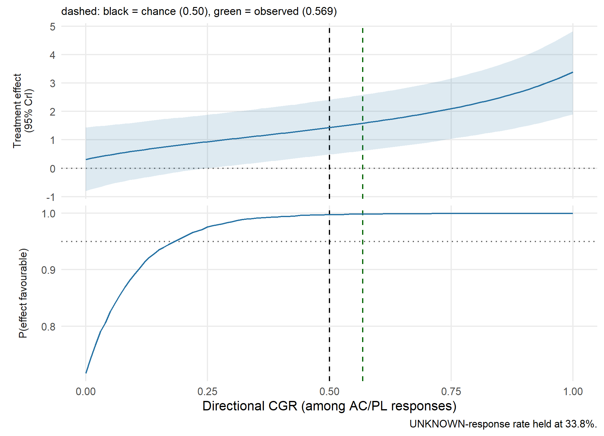

Here the ROPE is the point. P(favourable) is essentially 100%, but splitting the posterior at the 1.5-point MID shows that at perfect blinding only about 45% of the mass is a *meaningful* benefit; the rest is practically negligible. The effect is real and favourable, but only borderline clinically important.

```r
app_rope(san, xlab = "directional CGR (among AC/PL responses)")
```

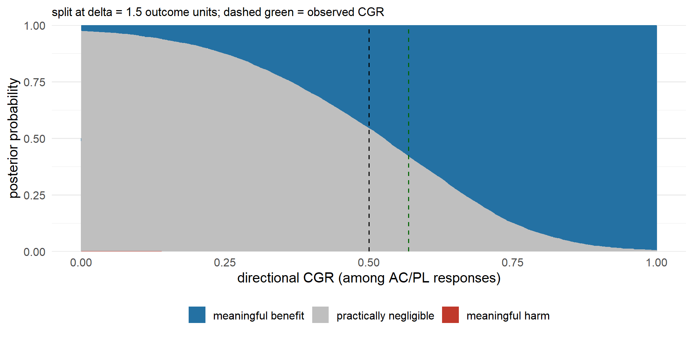

This is the clearest case for the UNKNOWN extension. 26 of 77 participants (34%) answered “I do not know.” Forcing the binary complete-case analysis keeps only 51 participants and leaves an active/placebo-guess stratum of a single person — and it does not merely discard data, it *distorts* the estimate: the complete-case adjusted effect is 0.65 points, against 1.43 when UNKNOWN is preserved across all 77. Preserving UNKNOWN, the reweighted pain benefit is favourable with P(favourable) essentially 100%, and barely moves from the raw estimate (1.58 → 1.43) because the directional CGR (0.569) is already close to 0.5. The decision-relevant number is the probability the effect clears the 1.5-point MID: 57% raw → 45% adjusted — a real, favourable effect sitting right at the edge of clinical importance.

## 17.3 Lii et al. (2023): ketamine masked by surgical anaesthesia — UNKNOWN

40 depressed patients received ketamine or placebo *under surgical anaesthesia*, so neither could feel the infusion; treatment belief was recorded at Closeout as *ketamine*, *placebo*, or *did not know*. The scalar outcome is mean MADRS across Days 1–3, where **lower is better**, so the analysis uses `direction = -1`.

```r
ket_df <- read_ext("ketamine_cgrc_unk.csv")
ket <- app_analyse(ket_df, "treatment_received", "treatment_guessed",
                   "madrs_mean_day1_3", direction = -1)
uk <- cgr_unknown_strata(ket$trial)
knitr::kable(data.frame(stratum = UNKNOWN_STRATA, n = lengths(uk)[UNKNOWN_STRATA]),
  caption = sprintf("Lii six strata; directional CGR %.3f (near chance), %d UNKNOWN of %d",
    ket$fit$observed_directional_cgr, ket$fit$n_unknown, ket$fit$n_total))
```

|      | stratum |   n |
|:-----|:--------|----:|
| ACAC | ACAC    |   9 |
| ACPL | ACPL    |   5 |
| ACU  | ACU     |   5 |
| PLAC | PLAC    |   8 |
| PLPL | PLPL    |   5 |
| PLU  | PLU     |   6 |

Lii six strata; directional CGR 0.519 (near chance), 11 UNKNOWN of 38

```r
knitr::kable(app_summary(ket), caption = "Lii / ketamine — mean MADRS Days 1-3 (lower is better; direction = -1)")
```

| Quantity                                       | Value           |
|:-----------------------------------------------|:----------------|
| Analysed n                                     | 38              |
| Observed correct-guess rate                    | 0.519           |
| Raw effect (at observed CGR)                   | -3.02           |
| Adjusted effect (CGR 0.50)                     | -2.80           |
| Adjusted 95% CrI                               | [-8.36, 2.63] |
| P(favourable): raw → adjusted                  | 87% → 86%       |
| P(exceeds 4.55-unit threshold): raw → adjusted | 28% → 25%       |

Lii / ketamine — mean MADRS Days 1-3 (lower is better; direction = -1)

```r
app_curve(ket, "favourable")
```

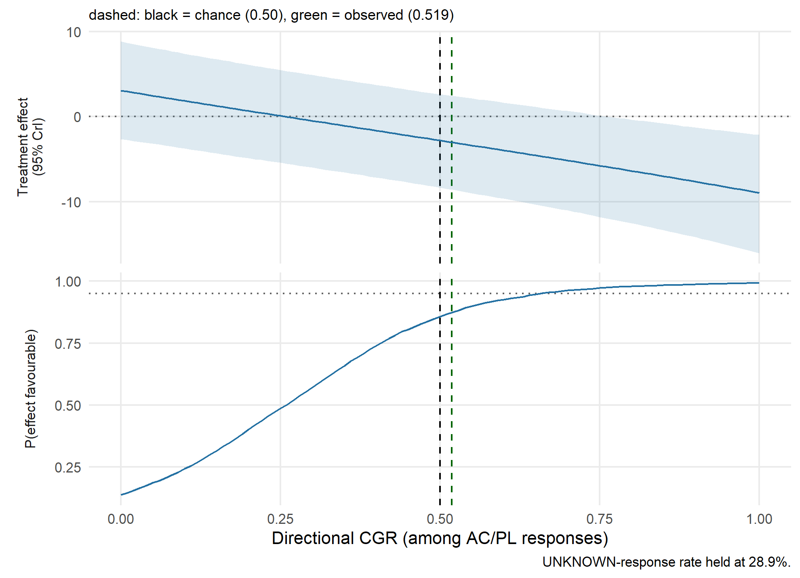

The ROPE tells the same cautionary story: the MADRS advantage is favourable, but at a half-SD meaningful-difference band only about 26% of the posterior is a meaningful benefit — most is practically negligible. P(favourable) alone would have overstated the clinical case.

```r
app_rope(ket, xlab = "directional CGR (among AC/PL responses)")
```

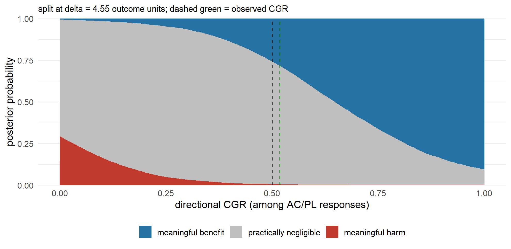

Guessing here is near chance (directional CGR 0.519): masked by anaesthesia, patients could not tell ketamine from placebo. That is exactly the regime where CGR adjustment *should* do almost nothing — and it does. The raw MADRS advantage of -3 points (favourable = lower) barely moves to -2.8 at perfect blinding, with P(favourable) 87% → 86%. Here the CGRC is *confirmatory*: because blinding held, the modest antidepressant signal is not an expectancy artefact — and with all six strata populated, the reweighting is well-defined rather than resting on a thin cell.

## 17.4 What the three trials add

- **Cavanna** is a clean binary example with all four strata populated. Its positive-control VAS shows a real drug effect that survives adjustment while its well-being outcome is null, and it carries the reconstructed-guess and effect-drives-guessing caveats explicitly.
- **Santana** is the strongest case for preserving UNKNOWN: a third of the sample answered “I do not know,” and complete-case restriction both strands them and distorts the estimate through a one-person stratum. The extension keeps the whole trial and finds a favourable pain effect at the clinical MID.
- **Lii** is the near-chance case: adjustment barely changes anything, which is the correct behaviour when blinding held, and it exercises the fully-populated six-stratum estimand.

Across all three, the behaviour is what the method predicts: CGR adjustment moves the estimate most when guessing departs from chance and the wrong-guess strata are populated, and does little when guessing is near chance — while the UNKNOWN-preserving variant keeps usable the trials the binary method would either distort through a near-empty stratum or discard through complete-case exclusion. None of these is a definitive re-analysis of the source trial; each is an illustration of the tool on independent, audited data, subject to the per-study caveats above and in `PROVENANCE.txt`.

**Data sources for this section.** Cavanna F, et al. (2022) *Transl. Psychiatry* 12:307 (data <doi:10.5281/zenodo.5745892>); Santana-Penín U, et al. (2023) *Ann. Anat.* 250:152117 (data <doi:10.5061/dryad.zkh189370>); Lii TR, et al. (2023) *Nat. Mental Health* 1:876–886 (data <doi:10.17605/OSF.IO/ZDKR8>). cgrc.bayes is independent of and not endorsed by these authors.

------------------------------------------------------------------------

# 18 Unresolved questions

1.  **Corrected JAGS prior.** **Resolved in this render.** `cgr_check_backends()` ran against JAGS: posterior means agree to 0.018 across the grid (max \|z\| = 1.34 relative to Monte Carlo error, max R-hat = 1.0001, min ESS = 39664), so the two backends target the same posterior and Section 8’s identity claim is supported. Reproducing this line requires a JAGS install; a render without rjags falls back to the NOT RUN note in Section 8.
2.  **n = 232 versus the published n = 233.** The source paper (Szigeti 2023) states n = 233 week-1 datapoints under exactly the `w1s1` filter used here, so the analysis rule is confirmed; the public file still gives 232. A genuine one-record gap, unexplained by the papers. See `reports/SOURCES.md`.
3.  **The 0.72 CGR — explained.** The paper’s Fig 4 caption states the trial CGR is 0.72, but that equals the *placebo-arm* correct-guess rate (0.7234); the analyzed data’s overall CGR is 0.647 (which reproduces the paper’s Table 2), and the author’s 2024 review cites ~65–70%. The Fig 4 reference line is therefore misplaced by ~0.07 — the error the Section 4 identity check catches. Worth one confirmation from the author. See `reports/SOURCES.md`.
4.  **Exact AEB simulation source not located.** The `noise = "all"` resolution now matches the paper’s published Table 1 (0.05/0.86/0.78/0.99) and Hedges g = 0.4, but the exact Eq. 4 SD scope lives in the paper’s Supplementary Table 1, so this is not yet a line-by-line code check.
5.  **No head-to-head operating-characteristic comparison** of the KDE procedure against the Bayesian one. Section 9 characterises the estimand, not the two procedures against each other.
6.  **Benign versus malicious unblinding is not testable** with these data.
7.  **KDE bandwidth.** The original uses sklearn’s fixed default of 1.0. Because the estimand uses only means this does not matter here, but it was never a deliberate choice and would matter for any tail-based estimand.

------------------------------------------------------------------------

# 19 Sources

The references below play distinct roles; only the first two underpin this work. Full per-finding citations are in `reports/SOURCES.md`.

- **Primary methodological source** — the original CGRC method paper reproduced here. Szigeti B, Nutt D, Carhart-Harris R, Erritzoe D. 2023. “The difference between ‘placebo group’ and ‘placebo control’: a case study in psychedelic microdosing.” *Scientific Reports* 13:12107. <https://doi.org/10.1038/s41598-023-34938-7> The binary CGRC estimand, the activated-expectancy-bias framework, the CGR curves and the empirical reproduction are based on this work.
- **Empirical dataset** — the source study for the public data reanalysed here. Szigeti B, et al. 2021. “Self-blinding citizen science to explore psychedelic microdosing.” *eLife* 10:e62878. <https://doi.org/10.7554/eLife.62878> Shipped as a checksum-verified copy in `data/pacutes.csv`.
- **Supporting literature** (contextual, *not* a CGRC methodological source). Szigeti B, Heifets BD. 2024. “Expectancy Effects in Psychedelic Trials.” *Biological Psychiatry: Cognitive Neuroscience and Neuroimaging* 9:512–521. <https://doi.org/10.1016/j.bpsc.2024.02.004> Supports interpretation of expectancy effects, blinding failure and approximate correct-guess rates.
- **Related expectancy literature** (context only; not the CGRC method or data). Szigeti B, Weiss B, Rosas FE, Erritzoe D, Nutt D, Carhart-Harris R. 2024. “Assessing expectancy and suggestibility in a trial of escitalopram v. psilocybin for depression.” *Psychological Medicine* 54:1717–1724. <https://doi.org/10.1017/S0033291723003653>

------------------------------------------------------------------------

# 20 Session information and reproducibility

```r
cat("R version:      ", R.version.string, "\n")
```

    ## R version:       R version 4.3.1 (2023-06-16 ucrt)

```r
cat("Platform:       ", R.version$platform, "\n")
```

    ## Platform:        x86_64-w64-mingw32

```r
cat("Seed:            20260721 (set in setup chunk)\n")
```

    ## Seed:            20260721 (set in setup chunk)

```r
cat("Data SHA-256:    86aa784528ee045c61fadf3eacfd3e1897d16aae9839cee7cb4bfe839a7cc4e3\n")
```

    ## Data SHA-256:    86aa784528ee045c61fadf3eacfd3e1897d16aae9839cee7cb4bfe839a7cc4e3

```r
cat("Data accessed:   2026-07-21\n")
```

    ## Data accessed:   2026-07-21

```r
cat("JAGS available: ", has_jags, "\n")
```

    ## JAGS available:  TRUE

```r
if (has_jags) cat("JAGS version:   ", as.character(rjags::jags.version()), "\n")
```

    ## JAGS version:    4.3.1

```r
sessionInfo()
```

    ## R version 4.3.1 (2023-06-16 ucrt)
    ## Platform: x86_64-w64-mingw32/x64 (64-bit)
    ## Running under: Windows 11 x64 (build 22621)
    ## 
    ## Matrix products: default
    ## 
    ## 
    ## locale:
    ## [1] LC_COLLATE=English_United States.utf8  LC_CTYPE=English_United States.utf8   
    ## [3] LC_MONETARY=English_United States.utf8 LC_NUMERIC=C                          
    ## [5] LC_TIME=English_United States.utf8    
    ## 
    ## time zone: America/Denver
    ## tzcode source: internal
    ## 
    ## attached base packages:
    ## [1] stats     graphics  grDevices utils     datasets  methods   base     
    ## 
    ## other attached packages:
    ## [1] ggplot2_4.0.3    cgrc.bayes_0.1.0
    ## 
    ## loaded via a namespace (and not attached):
    ##  [1] vctrs_0.6.5        cli_3.6.4          knitr_1.51         rlang_1.1.5        xfun_0.52         
    ##  [6] otel_0.2.0         generics_0.1.4     S7_0.2.0           jsonlite_2.0.0     labeling_0.4.3    
    ## [11] rjags_4-17         glue_1.8.0         htmltools_0.5.8.1  sass_0.4.9         scales_1.4.0      
    ## [16] rmarkdown_2.31     grid_4.3.1         tibble_3.2.1       evaluate_1.0.5     jquerylib_0.1.4   
    ## [21] fastmap_1.2.0      yaml_2.3.10        lifecycle_1.0.5    compiler_4.3.1     dplyr_1.1.4       
    ## [26] coda_0.19-4.1      RColorBrewer_1.1-3 pkgconfig_2.0.3    rstudioapi_0.18.0  lattice_0.21-8    
    ## [31] farver_2.1.2       digest_0.6.37      R6_2.6.1           tidyselect_1.2.1   pillar_1.11.1     
    ## [36] magrittr_2.0.3     bslib_0.11.0       withr_3.0.2        tools_4.3.1        gtable_0.3.6      
    ## [41] cachem_1.1.0
